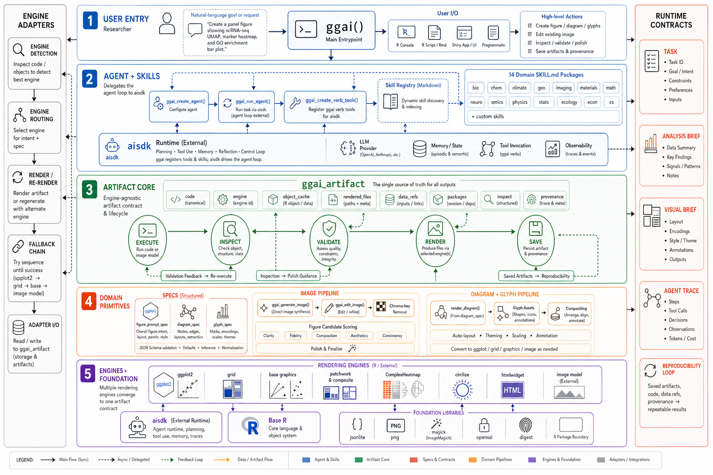
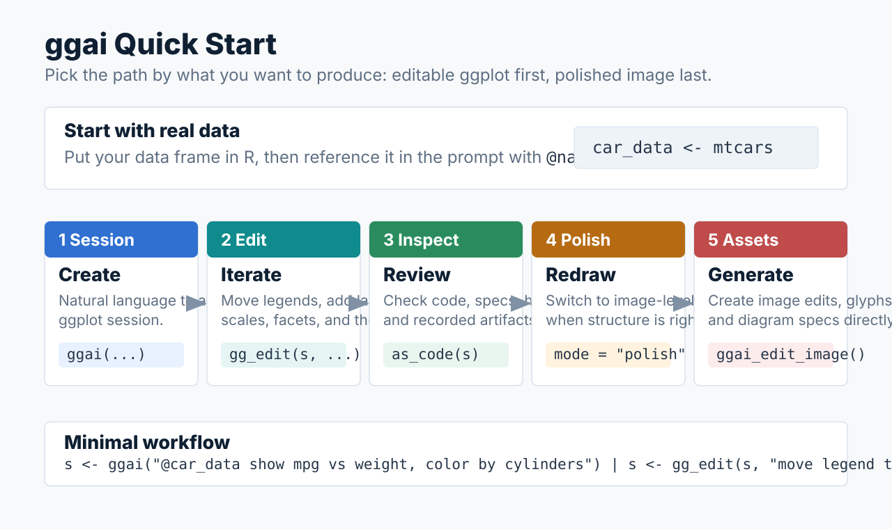
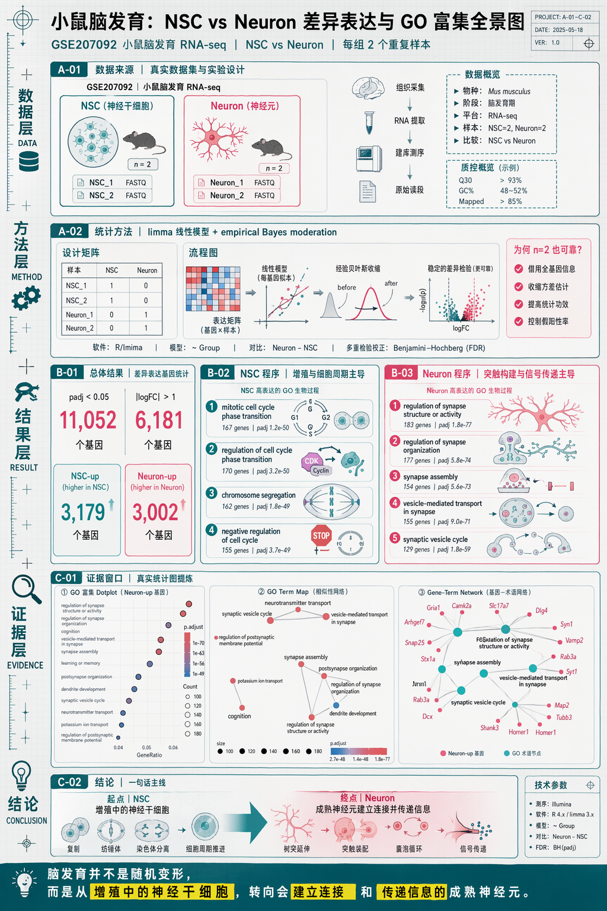
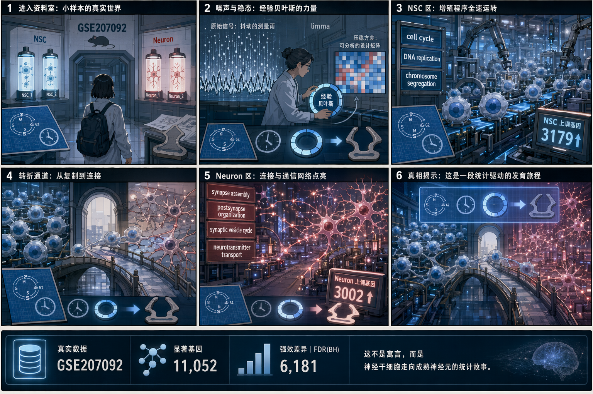
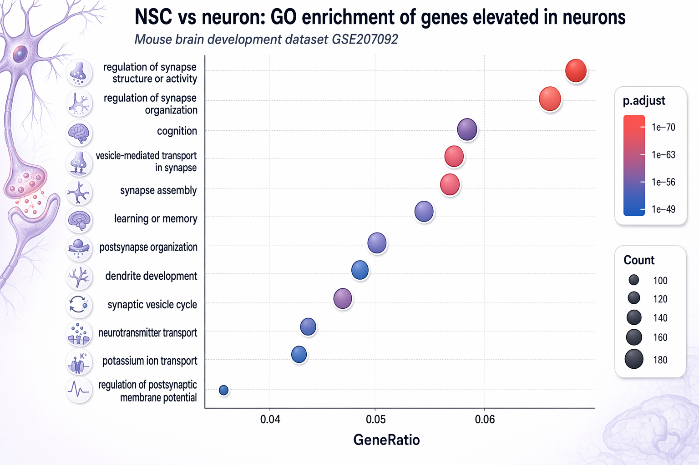
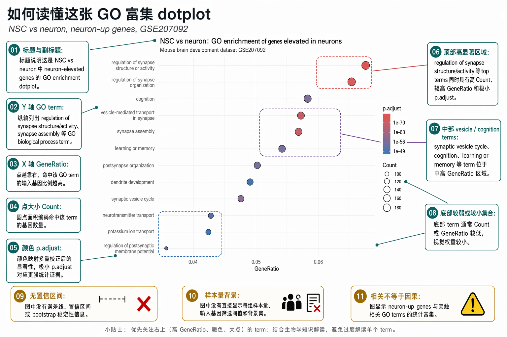
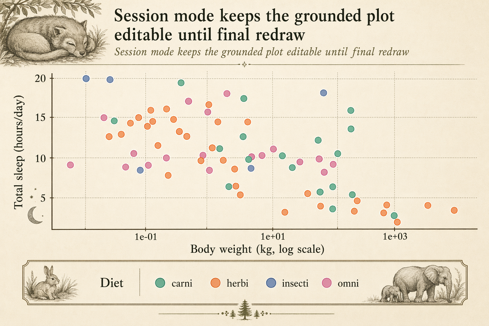
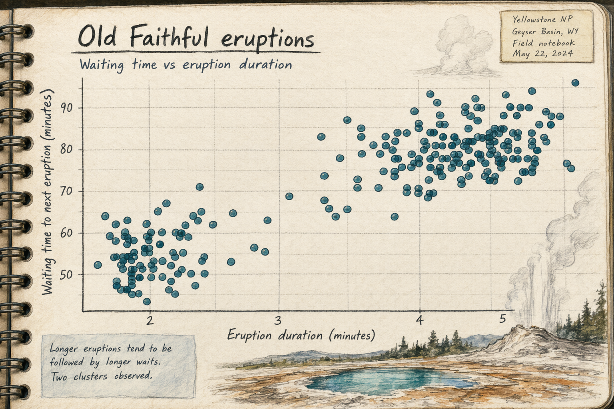
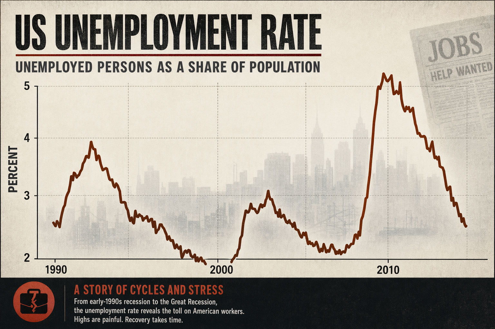

# ggai

`ggai` is an agent-based R package for turning natural-language figure instructions into:

- editable `ggplot2` augmentation layers
- diagram scene specs
- generated glyph assets
- data-grounded whole-image redraws for final polish

The intended workflow is:

1.  start from real data
2.  build a correct chart or editable session
3.  make structured edits while the figure is still a `ggplot`
4.  switch into whole-image redraw for final polish

## Architecture



## Quick Start



For model-backed agentic plotting, default model setup, iterative edits,
debugging output, candidate budgets, and multilingual/font issues, see the
[Agentic Quickstart FAQ](docs/ggai-agentic-quickstart-faq.md).

### 1. Load the package

``` r
pkgload::load_all("/path/to/aisdk", export_all = FALSE, helpers = FALSE)
pkgload::load_all("/path/to/ggai", export_all = FALSE, helpers = FALSE)
```

Or inside the repo:

``` r
pkgload::load_all(export_all = FALSE, helpers = TRUE)
```

### 2. Set API environment variables

`ggai` uses `aisdk` under the hood. For an OpenAI-compatible endpoint:

``` r
Sys.setenv(
  OPENAI_BASE_URL = "https://your-openai-compatible-endpoint/v1",
  OPENAI_API_KEY = "<your-api-key>",
  OPENAI_MODEL = "gpt-5.5",
  OPENAI_IMAGE_MODEL = "gpt-image-2"
)
```

For the polish path you will usually pass the image model explicitly:

``` r
image_model <- paste0("openai:", Sys.getenv("OPENAI_IMAGE_MODEL", "gpt-image-2"))
```

## Fastest Workflow

### Structured session mode

``` r
library(ggai)

car_data <- mtcars
s <- ggai(
  "@car_data show fuel efficiency vs weight, color by cylinders"
)

plot(s)
spec_history(s)
session_context(s)
```

Make structural edits while the figure is still grounded in `ggplot`:

``` r
s <- gg_edit(s, "move legend to bottom")
s <- gg_edit(s, 'set title to "Fuel efficiency vs weight"')
s <- gg_edit(s, "label the most extreme outlier")

plot(s)
as_code(s)
inspect_spec(s)
```

### Switch to whole-image redraw

Once the chart structure is right, switch into polish mode:

``` r
res <- gg_edit(
  s,
  "turn this into a publication hero figure with stronger hierarchy and cleaner typography",
  mode = "polish",
  image_model = image_model,
  total_timeout_seconds = 900,
  first_byte_timeout_seconds = 180,
  connect_timeout_seconds = 15,
  idle_timeout_seconds = 300
)
```

This returns a `ggai_polished_figure_result`.

Useful outputs:

- `res$best$path`: best final image
- `res$bundle_manifest_path`: structured redraw contract
- `res$candidate_manifest_path`: candidate summary
- `res$prompt_path`: prompt used for the redraw call
- `res$session`: updated session with recorded artifact history

### Inspect recorded artifacts

After a polish pass from a session:

``` r
artifacts(res$session)
latest_artifact(res$session)
latest_artifact(res$session, kind = "polish")
spec_history(res$session)
```

## One-Liner Entry Points

Go straight into session mode:

``` r
car_data <- mtcars
s <- ggai("@car_data show distribution of mpg", mode = "session")
```

Go straight into polish mode:

``` r
car_data <- mtcars
res <- ggai(
  "@car_data show fuel efficiency vs weight, color by cylinders",
  mode = "polish",
  polish_instruction = "make it feel like a flagship scientific product figure",
  image_model = image_model,
  total_timeout_seconds = 900,
  first_byte_timeout_seconds = 180,
  connect_timeout_seconds = 15,
  idle_timeout_seconds = 300
)
```

## Gallery

### 1. Advanced showcase: from differential expression to explanation graphics

This is the strongest end-to-end case in the repo right now.

It starts from a real published mouse brain-development dataset and pushes all the way through:

- differential expression
- `clusterProfiler` enrichment
- standard enrichment plots
- grounded redraw
- statistical plot-reader explainer
- high-density explainer board
- narrative explanation graphic

Source data:

- GEO: [GSE207092](https://www.ncbi.nlm.nih.gov/geo/query/acc.cgi?acc=GSE207092)
- Study citation: [PMID 36889368](https://pubmed.ncbi.nlm.nih.gov/36889368/)

The comparison is `NSC vs Neuron`. The README only shows the gpt-image-2 communication outputs; raw statistical plots and intermediate references are covered in the long-form docs.









Key calls:

``` r
# Grounded redraw of a real statistical plot
polish_res <- polish_figure(
  dot,
  instruction = "redraw this clusterProfiler enrichment figure as a polished developmental neurobiology explainer",
  image_model = image_model,
  prefix = "brain_dev_clusterprofiler_polish",
  total_timeout_seconds = 1800,
  first_byte_timeout_seconds = 900
)

# Explainer board: statistical references + communication prompt
infographic_res <- ggai_edit_image(
  model = ggai_image_model(image_model),
  image = evidence_refs[1:2],
  prompt = infographic_prompt,
  size = "1024x1536",
  output_dir = "demo_outputs"
)

# Story page: previous explainer + statistical grounding
story_res <- ggai_edit_image(
  model = ggai_image_model(image_model),
  image = c(infographic_res$images[[1]]$path, evidence_refs[1]),
  prompt = story_prompt,
  size = "1536x1024",
  output_dir = "demo_outputs"
)

# Plot-reader explainer: keep the chart visible, add numbered callouts
plot_reader_prompt <- paste(readLines("demo_outputs/brain_dev_plot_reader_prompt.txt"), collapse = "\n")
reader_res <- ggai_edit_image(
  model = ggai_image_model(image_model),
  image = "demo_outputs/brain_dev_clusterprofiler_dotplot.png",
  prompt = plot_reader_prompt,
  size = "1536x1024",
  output_dir = "demo_outputs"
)
```

This case matters because it is no longer just “pretty plotting”. One grounded analysis now supports several communication layers:

- NSC-up genes are dominated by cell-cycle and DNA-replication programs
- Neuron-up genes are dominated by synapse assembly, postsynaptic organization, synaptic vesicle cycling, and neurotransmitter transport

This same case also works as a research-discovery example, not only a communication example. It helps a researcher or mixed wetlab/computational team see the dominant pattern faster:

- `NSC` is dominated by proliferation, cell-cycle, and developmental patterning programs
- `Neuron` is dominated by synapse assembly, postsynaptic organization, vesicle cycling, and neurotransmitter transport
- the contrast reads as a developmental shift from division toward connectivity and communication

That does not prove mechanism. It does make the next questions clearer, earlier:

- is the key transition here cell-cycle exit coupled to synaptic maturation?
- which bridge genes or modules are worth validating first?
- which follow-up experiment should focus on patterning programs versus neuronal communication programs?

The plot-reader layer is different from polish: it keeps the statistical chart visible, then adds numbered line callouts that teach a non-specialist how to read axes, legends, dot size, color mapping, significance, uncertainty, sample-size context, and causality risk.

The infographic layer is for fast cross-disciplinary reading: dataset, method, counts, enrichment programs, and biological conclusion sit in one visual field.

The story layer goes one level higher again: it stops being a chart and starts behaving like an explanation page, so the reader can understand the developmental transition as a concept instead of only as a ranked term list.

Long-form walkthrough:

- [Brain Development Case Study](docs/cases/brain-dev/)
- [Generated case summary](docs/cases/brain-dev/brain_dev_clusterprofiler_summary.md)
- [Plot-reader analysis](docs/cases/brain-dev/brain_dev_plot_reader_analysis.md)
- [Infographic explanation](docs/cases/brain-dev/brain_dev_infographic_explanation.md)
- [Story figure explanation](docs/cases/brain-dev/brain_dev_story_explanation.md)

### 2. Multi-turn session editing over a grounded figure

This sequence keeps the figure in `ggplot` form through several edits, then switches to whole-image redraw only at the end.



``` r
car_data <- mtcars
s <- ggai("@car_data show fuel efficiency vs weight, color by cylinders")
s <- gg_edit(s, "label the most extreme outlier")

res <- gg_edit(
  s,
  "turn this into a publication hero figure with stronger hierarchy",
  mode = "polish",
  image_model = image_model
)
```

### 3. A scatter plot can be redrawn toward its context

The underlying chart is still just a scatter plot, but the final image leans into geothermal field-note context instead of staying as a generic statistical panel.



``` r
res <- polish_figure(
  geyser_plot,
  instruction = "redraw this scatter plot as a geothermal field-note explainer",
  image_model = image_model,
  prefix = "gallery_geyser"
)
```

### 4. Artistic reconstruction for a more interesting narrative frame

This example keeps a real time-series backbone but lets the image model rebuild it as an editorial poster rather than a plain line chart.



``` r
res <- polish_figure(
  economics_plot,
  instruction = "rebuild this time-series as an editorial poster while preserving the data trend",
  image_model = image_model,
  prefix = "gallery_economics"
)
```

## Reproducible Demo Scripts

The repo includes:

``` bash
Rscript demo/readme_polish_demo.R
Rscript demo/readme_gallery_demo.R
Rscript demo/brain_dev_clusterprofiler_case.R
Rscript demo/brain_dev_plot_reader_demo.R
Rscript demo/brain_dev_story_figure_demo.R
```

The minimal polish demo writes bundle artifacts with the prefix `readme_polish`.

The gallery demo writes showcase artifacts with these prefixes:

``` bash
gallery_session
gallery_geyser
gallery_economics
```

The brain-development demos write showcase artifacts with these prefixes:

``` bash
brain_dev_clusterprofiler
brain_dev_plot_reader
brain_dev_infographic
brain_dev_story
```

The final image redraw step depends on your image endpoint accepting an OpenAI-compatible `/images/edits` request. If the endpoint is only partially compatible, the bundle files still give you the grounded references needed to debug or reroute the final redraw call.

For slower image endpoints, use a relaxed timeout profile. A practical starting point is:

``` r
total_timeout_seconds = 1800
first_byte_timeout_seconds = 900
connect_timeout_seconds = 15
idle_timeout_seconds = 600
```

## Documentation

- [Quick Start FAQ](docs/ggai-agentic-quickstart-faq.md) - Model setup, debugging, and common issues
- [Architecture](docs/architecture.md) - Multi-agent architecture (Goal, Repair, Spec Committer, Acquisition)
- [Usage Scenarios](docs/usage-scenarios/) - Six runnable examples
- [Case Studies](docs/cases/) - Real-world analysis pipelines

## Notes

- Use `session` mode while chart logic is still changing
- Use `polish` mode only after the structure is stable
- `spec_history()` shows both structured edit turns and recorded polish artifacts
- All operations route through specialized agents (Goal, Repair, Spec Committer, Acquisition) that generate and validate code
