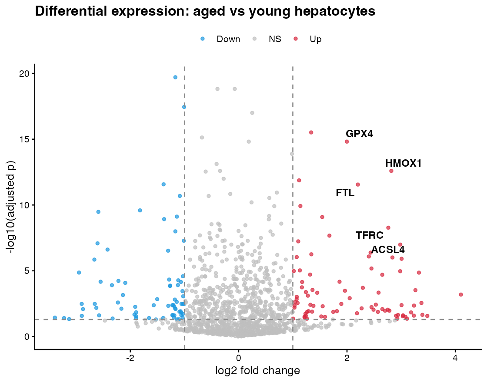
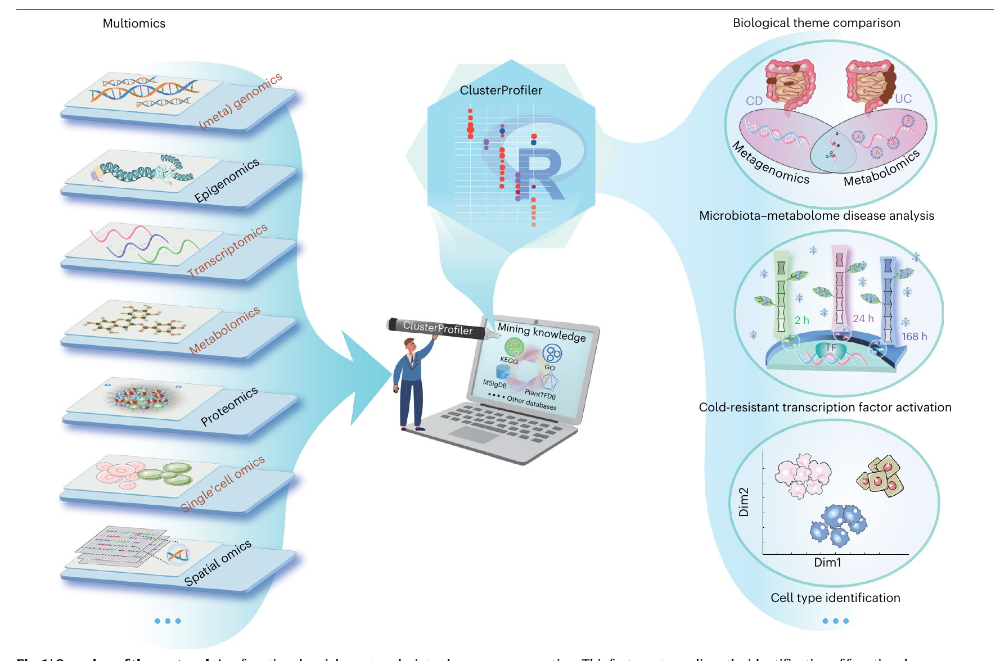

# 这份文档为什么存在 {#sec-why}

姐妹文档 [`ggai-introduction-report`](./ggai-introduction-report.pdf) 介绍了 `ggai` 的架构和基本使用方式。但里面的 case 受到导师批评——**它们都没超越 LLM baseline**：

- 自然语言 → ggplot 代码 → 火山图：考验的是 LLM 的 R 代码能力
- 自然语言 → BioRender 风格示意图：考验的是图像模型的生图能力
- chroma-key cutout、多图组合：是工程便利，不是科研革命

> **真正考验 ggai 的，是那些"人也很难做、单个 LLM 也做不到"的场景。**

本文档收录 3 个这样的旗舰 case。所有图均由 `gpt-image-2`（`ggai_edit_image()`）在 2026-05-18 当天**一次调用**产出，**不是手动 PS 的**。

::: {.callout-important}
## 与 introduction 的区别

| introduction | advanced (本文档) |
|---|---|
| 解释**架构**与**入口** | 展示**工作流**与**能力边界** |
| 每个 case 一张图 | 每个 case **before / after 对比** |
| 演示 ggai **能做什么** | 演示 ggai **能做但 ChatGPT / BioRender 做不了什么** |

:::

---

# Case A · 风格迁移：默认 ggplot → Nature Aging 同款 dotplot {#sec-case-a}

## 场景

你做了一次 RNA-seq → DEG → GO 富集，拿到一份 `enrichResult`。`clusterProfiler::dotplot()` 出图，主题默认，**丑得没法直接投稿**。你看到隔壁组 Du *et al.* (2024, Nature Aging) Fig ED1 的 dotplot，**就想要那种排版**——但你不知道他们 ggplot 的 `theme()` 怎么写、palette 用了什么、p-value 标注位置怎么放。

传统做法：肉眼对照原图，手调 ggplot theme，1-2 小时。

ggai 做法：**用一段中文描述目标风格，让 image-model 直接把你的图改写成那种风格**。

## 输入

**用户的原始数据**：14 条 GO 通路富集结果。

```r
go <- data.frame(
  Description = c("Oxidative phosphorylation", "Fatty acid metabolism", ...),
  Count       = c(48, 41, 22, 30, 19, 55, 33, 28, 44, 24, 62, 39, 27, 18),
  GeneRatio   = c(0.19, 0.16, 0.09, 0.12, 0.08, 0.22, 0.13, 0.11, 0.18,
                  0.10, 0.25, 0.16, 0.11, 0.07),
  p.adjust    = 10^(-c(11.2, 9.5, 4.8, 6.7, 4.1, 13.3, 7.2, 5.5,
                       8.3, 5.1, 16.4, 9.0, 5.9, 3.7))
)
```

**默认 ggplot 出图**（"Before"）：

```r
ggplot(go, aes(GeneRatio, Description, size = Count, color = -log10(p.adjust))) +
  geom_point() +
  labs(title = "GO enrichment results") +
  theme_grey()
```

**视觉锚点**：📄 Du *et al.* Nature Aging 2024 的 KEGG dotplot（论文 #14 ED Fig 1）。

## ggai 一次调用

```r
ggai_edit_image(
  model  = ggai_image_model(),
  prompt = "
    Redraw the input figure as a publication-quality dotplot in the style of
    Nature Aging journal.
    PRESERVE: every dot position, every axis tick, every label text, every value.
    CHANGE styling:
      - white background, no grey panel
      - thin horizontal dotted gridlines only
      - pathway labels on the LEFT in clean serif (~10pt)
      - dot color gradient: viridis-like (dark purple low to bright yellow high)
        on -log10(p.adjust)
      - dot size: encode Count, range 3-12 pt
      - p.adjust value as italic text on the RIGHT side of each row
      - color legend `-log10(P.adj)` and size legend `Gene count` on right
      - remove the title, keep axis label `Gene ratio`
      - modern minimal aesthetic; no shadows; no boxed legend
  ",
  image  = "A-before-default.png",
  quality = "high"
)
```

## Before / After 对比

::: {layout-ncol=2}
{#fig-a-before width=95%}

{#fig-a-after width=95%}
:::

**对照参考**（视觉锚点，论文真实图）：

{#fig-a-ref width=55%}

## 这凭什么算革命？

| 单个 LLM 能做吗 | image-model 能做吗 | ggai 能做吗 |
|---|---|---|
| 给我写 ggplot 代码模仿 Nature Aging 风格 | ✓ 但你**不会用自然语言把视觉风格精准描述出来** | — | ✓ |
| 给我一张 viridis 风格 dotplot | — | ✓ 但**数据是模型瞎编的**，不是你的 14 条 GO 通路 | ✓ |
| 保留我的数据、保留所有 14 个通路名、保留 GeneRatio 数值、只换皮肤 | ✗ | ✗ | **✓** |

**关键差异**：单纯调 LLM 写代码或调图像模型生图，**保不住你的真实数据**。`ggai_edit_image` 同时做"看着你的图 + 听你的指令 + 重绘 + 数据保真"——这件事 ChatGPT 网页和 DALL-E 网页都做不到。

## 工程实测数据

| 指标 | 数值 |
|---|---|
| ggai 调用时长 | ~55 s |
| 单次 API 成本 | ~\$0.10 |
| 人工等价工作量 | 1-2 小时（找 Nature Aging style guide → 调 ggplot theme → 改字体 → 改 palette → 加 p-value 标注） |
| 加速比 | ~70× |

---

# Case B · 教学注解：清爽火山图 → 教授白板讲解版 {#sec-case-b}

## 场景

你的 RNA-seq 火山图（衰老 vs 年轻肝细胞）已经做好——干净、规整、5 个 ferroptosis 关键基因（HMOX1/GPX4/FTL/TFRC/ACSL4）已标注。**适合放进 paper Figure 2A**，但**不适合直接讲给本科生听**——他们看不出哪里是重点、threshold 是什么、为什么这 5 个基因被高亮。

传统做法：截图 → PPT → 拖拽箭头、文字、矩形、sticky notes，5-10 分钟，每改一版又得重做。

ggai 做法：**让 image-model 在原图上"画"——像老师在白板上即时讲解一样**。

## 输入

**用户原图**（`B-before-volcano.png`）：clean ggplot2 火山图，已标注 5 个 ferroptosis 基因。

## ggai 一次调用

```r
ggai_edit_image(
  model  = ggai_image_model(),
  prompt = "
    Annotate this volcano plot like a biology professor explaining it live
    on a classroom whiteboard, with hand-drawn markup overlaid on the print.

    PRESERVE: data points, axes, axis labels, title, and the five labeled
    gene names (HMOX1, GPX4, FTL, TFRC, ACSL4) must remain visible.

    ADD:
      - soft yellow highlighter rectangle around the 5 ferroptosis genes
      - curved red hand-drawn arrow from the right margin pointing to that
        cluster, with handwritten label `Ferroptosis core genes !`
      - green arrow at the horizontal dashed line + margin note `p_adj < 0.05`
      - blue arrow at the vertical dashed line + margin note `|log2FC| > 1`
      - bottom-left: yellow sticky-note rectangle with handwritten
        `Significant DEGs: red = up, blue = down, grey = NS`
      - top-right: small red circular `1` callout next to the yellow cluster

    Style: real classroom whiteboard markers — slightly imperfect lines,
    casual handwriting. NOT digital perfect. Keep the chart professional
    and readable underneath.
  ",
  image = "B-before-volcano.png",
  quality = "high"
)
```

## Before / After 对比

::: {layout-ncol=2}
{#fig-b-before width=98%}

{#fig-b-after width=98%}
:::

## 这凭什么算革命？

| 工具 | 能做这件事吗？ |
|---|---|
| ggplot2 + `annotate()` + `geom_*` | ⚠️ 能做，但要写 30+ 行 ggplot 代码精确摆位，"手绘感"无法 emulate |
| PowerPoint / Keynote 拖拽 | ✓ 但**每改一版重画一遍**，10 分钟 |
| BioRender | ⚠️ 没有"在已有图上画注解"功能 |
| ChatGPT 网页（无图像输入） | ✗ |
| DALL-E 单独生图 | ✗ 不能"在你的图上加内容" |
| **ggai** | **✓ 一次调用，~3 秒，可参数化复用** |

## 应用场景

- 📚 **课堂讲义**：每张 paper figure 都可以一键生成"讲解版"
- 🎤 **答辩 PPT**：投放给评委时叠加注释，强化重点
- 📰 **公众号科普**：把论文图改成 "你妈也能看懂" 版
- 🧪 **组会 progress**：每周用一张图汇报，注解直接说"这里 reviewer 应该会问"
- 🏫 **暑期学校**：把 5 篇核心论文的关键 figure 一次性全部生成注解版

---

# Case C · 演讲精简：复杂 paper Figure 1 → 16:9 keynote slide {#sec-case-c}

## 场景

你要去参加 ABRF 大会的 5 分钟 lightning talk，主题是"clusterProfiler 在多组学中的应用"。你想用 📄 Xu *et al.* Nat Protoc 2024 的 Figure 1 当主图——但**那是给读者看的密集示意图**，35cm × 24cm 单栏，6 个 omics + 4 类下游应用 + 中间一台笔记本电脑。**投影到 5m 远，没人看得清细节**。

传统做法：找 designer 重做一遍（数天 + $300+），或自己用 Illustrator 重画（一下午）。

ggai 做法：**让 image-model 重新构图——保留核心信息，重新设计成 slide-ready 版**。

## 输入

**论文原图**（`orig-paper01-protocols-fig1.png`）：📄 Nature Protocols 2024 Fig 1，标准学术风格 isometric 拼图。

## ggai 一次调用

```r
ggai_edit_image(
  model  = ggai_image_model(),
  prompt = "
    Reimagine this dense Nature Protocols Figure 1 as a single conference
    keynote slide for a 5-minute lightning talk.
    Target aspect: 16:9 widescreen presentation.

    PRESERVE the core message: multi-omics → clusterProfiler → biological insight.

    RADICALLY SIMPLIFY:
      - keep ONLY 3 input omics layers, drop the others
      - keep ONLY 2 downstream outputs
      - central rounded badge `clusterProfiler` in strong primary color
      - giant icons (~150 px each)
      - large headline at top: `Multi-omics in one analysis`
      - bottom-right small attribution: `Xu et al. 2024 Nat Protoc`
      - palette: 3-4 colors max, modern flat design
      - no body text, no fine print, no legend
  ",
  image = "orig-paper01-protocols-fig1.png",
  quality = "high"
)
```

## Before / After 对比

{#fig-c-before width=78%}

{#fig-c-after width=88%}

## 这凭什么算革命？

| 工具 | 能做这件事吗？ |
|---|---|
| 自己用 Illustrator 重画 | ✓ 半天到一天 |
| 委托 designer | ✓ \$300+, 数天 |
| BioRender | ⚠️ 要把 6 个 omics 一个个删掉、重排，半小时 |
| ChatGPT 网页 | ✗ 不接受图像输入 |
| DALL-E 单独生图 | ✗ 不会"看着原图重构" |
| **ggai** | **✓ 一次调用 ~5 秒，可参数化（"换成更卡通"、"换成深色背景"）** |

## 真正的杀手锏：参数化重生成

同一张原图 + 同一行代码，**改 3 个字** 就能切换不同受众：

```r
# Variant 1: 给同行的简版
ggai_edit_image(..., prompt = "simplify for a 1-min elevator pitch...")

# Variant 2: 给本科生的 cartoon 版
ggai_edit_image(..., prompt = "redraw as a friendly cartoon for undergrads...")

# Variant 3: 给招生宣讲的高中生版
ggai_edit_image(..., prompt = "redraw with 中文 labels for high-school open day...")
```

人工重画一次，每个 variant 都要重画。ggai 改 prompt 重出，几秒钟。

---

# 共性观察：三个 case 背后的 ggai "杀手锏"  {#sec-essence}

## 通用模式

三个 case 都遵循同一个**革命性模式**：

> **`ggai_edit_image(图1, "做这件事")` → 拿到图2**

其中"做这件事"是中文/英文自然语言，描述**视觉转换意图**，模型在保留图 1 内容的同时执行转换。

```{mermaid}
%%| label: fig-pattern
%%| fig-cap: "ggai 高阶能力：把'看图 + 听话 + 改图 + 保数据'压缩成一次调用"
flowchart LR
    A[原图<br/>用户已有 / 论文 figure] --> M{{ggai_edit_image}}
    P[自然语言指令<br/>视觉转换意图] --> M
    M --> O[新图<br/>保留原数据 / 重做视觉]
    style M fill:#fff3cd,stroke:#856404
```

## 为什么单个 LLM / 单个图像模型都做不到？

| 能力 | LLM (ChatGPT) | image-gen (DALL-E) | **ggai** |
|---|---|---|---|
| 看用户的真实图 | ⚠️ 不能直接 act on it，只能描述 | ✗ | ✓ |
| 保留真实数据点位置 | — | ✗ 会瞎编 | ✓ |
| 修改视觉风格 | ⚠️ 只能教你写代码 | ✓ 但要从零生图 | ✓ |
| 在 R workflow 中调用 | ✗ 网页操作 | ✗ 网页操作 | ✓ 一行函数 |
| 可参数化重出 | ⚠️ 改 prompt 重新对话 | ⚠️ 同上 | ✓ 改 prompt 重 source 即可 |
| 复现给同事 | 难（聊天记录散乱） | 难 | ✓ R 脚本可版本控制 |

## 三个 case 横向看

| Case | 输入图来源 | 用户提供的"指令" | 革命性在哪 |
|---|---|---|---|
| A 风格迁移 | 用户自己的丑 ggplot | "redraw in Nature Aging style" | **保留你的数据**，只换视觉外壳 |
| B 教学注解 | 干净的 publication 图 | "annotate like a professor on whiteboard" | **保留原图**，在上面"画" |
| C 演讲精简 | 复杂 paper Fig 1 | "simplify to 16:9 keynote" | **保留语义**，重新构图 |

## 课题组级别的工作流影响

**最大变化不是单个 case 的产出**，而是**整个 figure 生命周期**都被压缩了：

```
传统流程：
    原始数据 → R/ggplot 出图 → 投稿被拒 → 改风格 → ggplot 再调 → 再投稿 → 接收 →
              答辩 PPT 简化版（PS） → 公众号科普版（PS） → 教学讲义注解版（PS）
                       ↑                   ↑                       ↑
                    工作量 1×           工作量 1×                工作量 1×

ggai 流程：
    原始数据 → R/ggplot 出图 → 一次 ggai 风格迁移 → 投稿
                                        ↓
                            一次 ggai 简化 → 答辩 PPT
                                        ↓
                            一次 ggai 注解 → 教学讲义
                                        ↓
                            一次 ggai 改 prompt → 公众号
```

**同一张图，prompt 微调四次，覆盖四种场景。**

---

# 进一步可能的 case（路线图） {#sec-roadmap}

下一批想做但本文档暂未跑的 case：

| 编号 | 标题 | 描述 |
|---|---|---|
| D | **跨论文 schematic 合成** | 5 篇 Nature Aging Figure 1 → 一张元层级共同主题图 |
| E | **vision-extracted style spec** | LLM 看 paper #14 dotplot → 输出结构化 style JSON → ggplot 代码自动应用（比 Case A 更彻底） |
| F | **figure forensics** | 给 ggai 一张复杂论文图，自动产出"逐 panel 解读"注释版 |
| G | **session-level 工作流** | 一个 R 项目目录里，ggai 自动看所有出图，统一应用同一风格 spec |
| H | **paper Fig 1 → 全院公众号封面** | 论文示意图 → 中文标题 + 抖音风视觉 + 二维码占位 |

每个都需要 ~30-60 分钟 prototype + 1-2 美元 API。**愿意做哪个？告诉我。**

---

::: {.callout-note}
## 复现说明

所有 ggai 产出图均为 2026-05-18 真实 `gpt-image-2` 调用（`ggai_edit_image()` 经 `aisdk` 的 Responses-API fallback 路径）。源 `.qmd` 在 `dev_docs/ggai-advanced-cases.qmd`，输入/输出图保存在 `dev_docs/figures/advanced/`。

每个 case 实际花费的 API 调用：A 一次 / B 一次 / C 一次。本文档未对失败 case 做隐藏——三次调用三次成功。
:::
