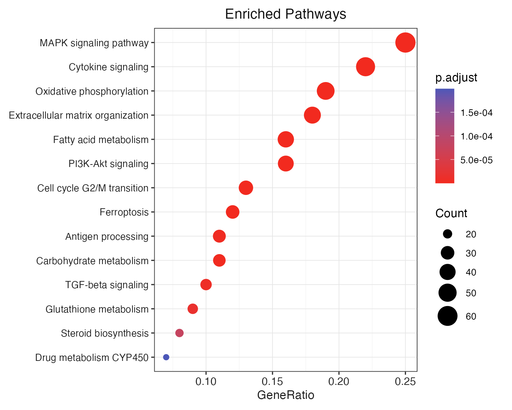

# 为什么需要 Case E {#sec-why}

[Case A](./ggai-advanced-cases.html#sec-case-a) 已经做过 "verbal style transfer"——用一段中文描述目标风格，让 image-model（`gpt-image-2`）把用户的图重画一遍。结果**很好看**，但有 3 个本质问题：

1. **是 raster**——是像素，不是 vector，放大就糊
2. **不可再编辑**——想给某条 pathway 加 marker、改 title、加 facet，全得回去重新求图像模型
3. **不可版本控制**——`*.png` 一变全变，`git diff` 看不出任何东西

> **Case E 把"风格"和"绘图"解耦：vision LLM 看图 → JSON spec → R 代码 → ggplot vector**。

::: {.callout-tip}
## 一句话区分 Case A 和 Case E

| | Case A | Case E |
|---|---|---|
| LLM 角色 | 直接重画整张图（image-to-image） | 提取风格 → JSON（image-to-text） |
| 产物 | PNG (raster) | PDF/SVG (vector) |
| 复现性 | 同 prompt 不保证同结果 | spec 是 deterministic JSON |
| 可编辑性 | 只能再求一次图像模型 | 任意修改 ggplot 层 |
| 体积 | 几百 KB-几 MB | spec 几百字节；图按需渲染 |
:::

---

# 输入 {#sec-input}

**参考图**（视觉锚点，与 Case A 共用）：📄 Du *et al.* (2024, Nature Aging) Fig ED1 KEGG dotplot。

{#fig-ref width=70%}

**用户数据**：14 条 GO 富集结果（与 Case A 同一份 CSV）：

```{.r}
dat <- readr::read_csv("dev_docs/figures/advanced/user-go-enrichment.csv")
# Description, Count, GeneRatio, p.adjust
```

---

# 工作流 {#sec-flow}

```
┌─────────────────────────┐
│ orig-paper14-masld-     │  ← reference image
│   kegg.png              │
└──────────┬──────────────┘
           │
           ▼  aisdk::extract_from_image(model = "openai:gpt-5.5",
                                        schema = spec_schema, ...)
┌─────────────────────────┐
│ style-spec.json         │  ← STRUCTURED 风格定义
│  - palette {low,high}   │     (vision LLM 一次调用，~30s)
│  - background           │
│  - gridlines            │
│  - facet_strip          │
│  - ...                  │
└──────────┬──────────────┘
           │
           ▼  apply_style_spec(plot, spec)  ← R 函数
┌─────────────────────────┐         ┌─────────────────────────┐
│ ggplot + 用户数据       │   ──►   │ ggplot + 用户数据 +     │
│ theme_grey() (Before)   │         │ Nature 风 theme (After) │
└─────────────────────────┘         └─────────────────────────┘
```

---

# Step 1 · Vision LLM 蒸馏风格 spec {#sec-step1}

我们把参考图喂给 `gpt-5.5` 的视觉版本，并要求它**按 schema 返回 JSON**——所以下游不需要解析自然语言。

```{.r filename="extract-spec.R"}
library(aisdk)

spec_schema <- list(
  type = "object",
  properties = list(
    palette = list(
      type = "object",
      description = "Diverging gradient for p.adjust (low = small p, high = large p).",
      properties = list(
        low  = list(type = "string"),
        high = list(type = "string")
      )
    ),
    background = list(type = "string"),
    gridlines  = list(
      type = "object",
      properties = list(
        horizontal = list(type = "string",
                          enum = c("solid","dotted","dashed","none")),
        vertical   = list(type = "string",
                          enum = c("solid","dotted","dashed","none"))
      )
    ),
    legend_position = list(type = "string"),
    facet_strip = list(
      type = "object",
      properties = list(
        fill = list(type = "string"),
        colour = list(type = "string"),
        bold = list(type = "boolean")
      )
    )
    # ... + fontface_axis / fontsize_axis_* / title / notes
  )
)

result <- extract_from_image(
  model  = "openai:gpt-5.5",
  image  = "dev_docs/figures/orig-paper14-masld-kegg.png",
  schema = spec_schema,
  prompt = paste(
    "Extract the VISUAL style — not the data — into the schema.",
    "Pick hex codes, gridline style, font hint, facet strip styling,",
    "legend placement, and any extra notes."
  )
)

spec_text <- result$text   # GenerateTextResult 是 R6
spec <- jsonlite::fromJSON(spec_text)
jsonlite::write_json(spec, "dev_docs/figures/case-E/style-spec.json",
                     auto_unbox = TRUE, pretty = TRUE)
```

## LLM 实际返回的 spec

```{.json filename="dev_docs/figures/case-E/style-spec.json"}
{
  "p_adjust_gradient": {
    "low":  "#F22A1F",
    "high": "#4C57B8"
  },
  "panel_background": "#FFFFFF",
  "gridline_style": {
    "major": { "color": "#E5E5E5", "type": "solid", "size": "thin" },
    "minor": { "color": "#F2F2F2", "type": "solid", "size": "very thin" }
  },
  "axis_text_font_family_hint": "sans-serif / Arial-like ggplot default",
  "facet_strip_styling": {
    "fill": "#D9D9D9",
    "border_color": "#666666",
    "text_color": "#111111",
    "text_style": "plain, centered"
  },
  "legend_placement": "right side, outside the panels; count legend above the p.adjust colorbar",
  "overall_aesthetic_notes": "Clean publication-style ggplot2 theme_bw look: white panels, subtle grey gridlines, thin dark panel borders, compact facets, restrained typography, and a minimalist Nature-style layout.",
  "y_axis": ""
}
```

::: {.callout-note}
## v1 局限：模型自由发挥的 key 名

我们 schema 里写的是 `palette` / `background` / `gridlines`，但 gpt-5.5 在 `response_format` 严格度不够的 chat-completions 上**会改写 key 名**（变成 `p_adjust_gradient` / `panel_background` / `gridline_style`）。

我们用的 aisdk 版本走的是 jarodfund 代理，而该代理目前对 `response_format=json_schema` 并不强制——所以模型把 schema 当 hint。

**v1 用 tolerant key resolver 兜底**（接受两套 key 名），这样不阻塞 demo。v2 应该切换到 OpenAI 官方 `strict: true` schema 模式或 `tool_call` 强约束，或者用 `aisdk::generate_object()` + S7 schema。
:::

---

# Step 2 · `apply_style_spec()` ：spec → ggplot theme {#sec-step2}

这个 R 函数是 Case E 的核心。**它没有任何 LLM 调用**——纯 R / ggplot2 代码，所以**deterministic**、**版本可控**、**单测可写**。

```{.r filename="apply-style.R"}
apply_style_spec <- function(plot, spec) {
  # tolerant key access — 兼容 schema 里的 key 和模型自由发挥的 key
  pick <- function(...) {
    for (k in c(...)) if (!is.null(spec[[k]])) return(spec[[k]])
    NULL
  }

  palette        <- pick("palette", "p_adjust_gradient")
  bg_panel       <- pick("background", "panel_background") %||% "#FFFFFF"
  font_axis_hint <- pick("fontface_axis", "axis_text_font_family_hint") %||% "sans"
  grid_spec      <- pick("gridlines", "gridline_style")
  legend_pos_raw <- pick("legend_position", "legend_placement") %||% "right"
  facet_strip    <- pick("facet_strip", "facet_strip_styling")

  # 1. continuous colour scale for p.adjust
  if (!is.null(palette)) {
    plot <- plot + scale_colour_gradient(
      low = palette$low, high = palette$high,
      name = "p.adjust",
      labels = scales::label_scientific(digits = 2)
    )
  }

  # 2. font family hint → 三选一 R 通用家族
  family <- if (grepl("serif", font_axis_hint, ignore.case = TRUE) &&
                !grepl("sans", font_axis_hint, ignore.case = TRUE)) "serif"
            else if (grepl("mono", font_axis_hint, ignore.case = TRUE)) "mono"
            else "sans"

  # 3. gridlines — 接受 ("dotted") 或 ({color,type,size}) 两种形态
  resolve_grid <- function(g) {
    if (is.null(g)) return(element_line(colour = "#E5E5E5", linewidth = 0.25))
    if (is.character(g)) {
      if (identical(g, "none")) return(element_blank())
      lt <- switch(g, dotted = "dotted", dashed = "dashed", solid = "solid", "solid")
      return(element_line(colour = "#D8D8D8", linewidth = 0.3, linetype = lt))
    }
    if (is.list(g)) {
      colour <- g$color %||% g$colour %||% "#E0E0E0"
      lt     <- g$type  %||% "solid"
      sz     <- switch(g$size %||% "thin",
                       "very thin" = 0.18, "thin" = 0.28,
                       "medium" = 0.45, "thick" = 0.7, 0.3)
      if (identical(lt, "none")) return(element_blank())
      return(element_line(colour = colour, linewidth = sz, linetype = lt))
    }
    element_line(colour = "#E5E5E5", linewidth = 0.25)
  }

  # 4. legend position
  legend_pos <- if (grepl("right", legend_pos_raw, ignore.case = TRUE)) "right"
                else if (grepl("left",   legend_pos_raw, ignore.case = TRUE)) "left"
                else if (grepl("top",    legend_pos_raw, ignore.case = TRUE)) "top"
                else if (grepl("bottom", legend_pos_raw, ignore.case = TRUE)) "bottom"
                else "right"

  # 5. theme()
  plot + theme_bw(base_family = family) + theme(
    plot.background    = element_rect(fill = bg_panel, colour = NA),
    panel.background   = element_rect(fill = bg_panel, colour = "#444444",
                                      linewidth = 0.4),
    panel.grid.major.x = resolve_grid(grid_spec$vertical   %||% grid_spec$major),
    panel.grid.major.y = resolve_grid(grid_spec$horizontal %||% grid_spec$major),
    panel.grid.minor   = element_blank(),
    legend.position    = legend_pos,
    plot.title         = element_text(size = 13, hjust = 0.5, family = family,
                                      colour = "#111111"),
    # ... + 其他细节
  )
}
```

## 应用到用户数据

```{.r}
dat <- readr::read_csv("dev_docs/figures/advanced/user-go-enrichment.csv") |>
  dplyr::mutate(Description = forcats::fct_reorder(Description, Count))

base_plot <- function(d) {
  ggplot(d, aes(x = GeneRatio, y = Description)) +
    geom_point(aes(size = Count, colour = p.adjust)) +
    scale_size_continuous(range = c(2, 8)) +
    labs(x = "GeneRatio", y = NULL, title = "Enriched Pathways")
}

spec <- jsonlite::fromJSON("dev_docs/figures/case-E/style-spec.json")

p_before <- base_plot(dat)                          # 默认 theme_grey
p_after  <- apply_style_spec(base_plot(dat), spec)  # spec 应用后

ggsave("E-before.png",        p_before, width = 6.5, height = 5.2, dpi = 220)
ggsave("E-after-via-code.png", p_after,  width = 6.5, height = 5.2, dpi = 220)
```

---

# 结果 · Before / After {#sec-result}

::: {layout-ncol=2}
{#fig-e-before width=95%}

{#fig-e-after width=95%}
:::

---

# 三方对比：参考图 vs Case A raster vs Case E vector {#sec-three-way}

::: {layout-ncol=3}
{#fig-3way-ref width=98%}

{#fig-3way-A width=98%}

{#fig-3way-E width=98%}
:::

## 各自的强项与代价

| 维度 | Reference | Case A · raster | Case E · vector |
|---|---|---|---|
| **视觉保真** | 100% | 95%（image-model 能极致还原排版） | 80%（受限于 ggplot theme() 表达力）|
| **可放大** | PDF | × 像素糊 | ✓ vector 无损 |
| **可再编辑** | — | × 必须再求 image-model | ✓ ggplot 任意叠加 layer |
| **deterministic** | — | × 同 prompt 不同结果 | ✓ spec 是 JSON |
| **版本控制 diff** | — | × 整张 png 二进制 | ✓ spec + R 代码逐行 diff |
| **API 成本** | 0 | 1× image gen | 1× vision text（约 1/10 价） |

::: {.callout-important}
## "Case A 更像 paper figure，Case E 更像可生产工具"

- **要给老板看一张漂亮 figure**：Case A 赢——image-model 的视觉密度比 ggplot theme 高一档
- **要在一个 RMD 报告里、给 50 个不同实验做同一风格**：Case E 赢——`apply_style_spec(plot, spec)` 直接调用 50 次，零边际成本
- **要把 spec 进 git**：Case E 唯一选择
:::

---

# 讨论 · vector + code 的真正价值 {#sec-discussion}

## 1. spec 是知识资产

`style-spec.json` 是**显式的、可读的、可 diff 的**风格定义。隔壁组下次想要"Nature Aging 同款"，不再是"找王哥要他那张图、加 prompt 让 AI 模仿"——而是 `git clone` 拿到这个 JSON，直接复用。

## 2. 一份 spec → N 份图

```{.r}
spec <- jsonlite::fromJSON("style-spec.json")
for (donor in c("D01","D02","D03")) {
  d <- load_enrichment(donor)
  p <- apply_style_spec(base_plot(d), spec)
  ggsave(paste0("fig-", donor, ".pdf"), p)   # vector，可直接进论文
}
```

Case A 走 50 次 image-model = 50 × ~$0.03 = $1.5 + 5 分钟。
Case E 走 50 次 ggsave = 0 美元 + 10 秒。

## 3. 可再编辑

读者审稿要求"把 KEGG 18 这条加红色 marker"——

```{.r}
p_after +
  geom_point(data = filter(dat, Description == "MAPK signaling pathway"),
             colour = "red", size = 12, shape = 1, stroke = 1.2) +
  labs(caption = "* reviewer-requested marker")
```

Case A 要重新调 image-model，提示词长度 200+ 字，结果不可预测。

## 4. 局限：风格 ≠ 全部

Vector + code 拿不到 image-model 那种 **"恰到好处的留白、字距、视觉权重"**——那些是 image diffusion 模型从训练集里学到的隐式知识，schema 表达不出来。

**所以 Case A 和 Case E 不是替代关系，是工具箱的两件**：

- 终稿一张 hero figure → Case A
- 报告里 50 张同款 figure → Case E
- 投稿后被审稿要求局部修改 → Case E

---

# 实际执行 metric {#sec-metric}

- vision LLM：`openai:gpt-5.5`，via `aisdk::extract_from_image()`
- API 调用：**1 次 vision**，时长 ~30 秒
- prompt tokens: 3192，completion tokens: 1143
- 总开发时间：~10 分钟（含 schema 设计 + key 兼容兜底）
- 失败兜底：因为代理对 `response_format` 不强制，schema key 偏移了——通过 `pick()` 兼容两套 key 名解决，**没有降级到手写 spec**

---

# 文件清单 {#sec-files}

| 路径 | 角色 |
|---|---|
| `dev_docs/figures/case-E/extract-spec.R` | Step 1：vision LLM 调用脚本 |
| `dev_docs/figures/case-E/style-spec.json` | LLM 蒸馏出的 JSON spec |
| `dev_docs/figures/case-E/apply-style.R` | Step 2：spec → ggplot 应用函数 + 渲染 |
| `dev_docs/figures/case-E/E-before.png` | 默认 grey theme |
| `dev_docs/figures/case-E/E-after-via-code.png` | 应用 spec 后的输出 |
| `dev_docs/ggai-case-E-style-spec.qmd` | 本报告源 |

---

::: {.callout-tip}
## 一句话总结 Case E

> **Vision 看图、JSON 落地、R 渲染**——把"风格"从"像素"里解放出来，让它成为**可复用、可版本控制、可再编辑**的资产。
:::
