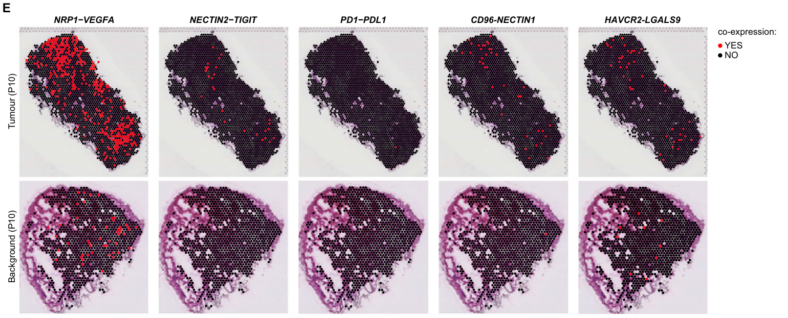

# 这份文档为什么单独成卷 {#sec-why}

[`ggai-advanced-cases.qmd`](./ggai-advanced-cases.pdf) 收录了三个"超越 LLM
baseline"的旗舰 case（A 风格迁移 / B 教学注解 / C 演讲精简）。Case F 是 case B
的**系统化升级**：

| 维度 | Case B（白板讲解版） | **Case F（forensics 注释版）** |
|---|---|---|
| 输入图 | 单 panel 火山图 | **多 panel 矩阵**（2 行 × 5 列 Visium 空间共表达） |
| 注解粒度 | 1-2 个高亮 + sticky-note | **每 panel 独立编号 + 颜色 + caption** |
| 风格基调 | 教授白板涂鸦 | **reviewer 在 PDF 上做批注** |
| 服务对象 | 课堂上的本科生 | **reviewer / 答辩准备 / 一年级研究生第一次读这种图** |

---

# 场景：reviewer 在 NSCLC paper Figure 3 前发呆 5 分钟 {#sec-scene}

你审 Nature Comms 一份投稿，Figure 3 长这样：

> 2 行 × 5 列的 Visium 空间共表达图。
> 列：5 对 ligand-receptor (NRP1-VEGFA / NECTIN2-TIGIT / PD1-PDL1 /
> CD86-NECTIN1 / HAVCR2-LGALS9)。
> 行：Tumor (P15) / Background (P15)。

第一眼信息量爆炸——5 列每列在讲什么？哪些是 immune checkpoint 哪些是
angiogenesis？为什么这 5 对配对放在一起？

**传统做法**（reviewer 视角）：

1. 打开 PowerPoint / Goodnotes，把图截过去
2. 拖编号圆圈 → 调色 → 拖箭头 → 拖文本框 → 写 caption
3. 每 panel 约 **10 分钟**——5 panels = **50 分钟**
4. 改一版颜色或字号，每个 panel 重做

**ggai 做法**：写一段 prompt，**一次 API 调用** ~2.5 分钟，全部 panel 注解到位。

> 这不是"把图变好看"，是**把 reviewer / 答辩人 / 学生的批注思维过程压缩成一次调用**。

---

# 输入图与 paper 背景 {#sec-input}

源图：`dev_docs/figures/orig-paper06-nsclc-fig3.png`（论文 #06，NSCLC Visium
ligand-receptor co-expression，Fig 3 的 panel E）。

{#fig-f-before width=95%}

5 个 ligand-receptor 对横跨**三种生物学语境**：

- **angiogenesis**: NRP1-VEGFA
- **immune checkpoints**: NECTIN2-TIGIT / PD1-PDL1 / HAVCR2-LGALS9
- **co-stimulation / APC interface**: CD86-NECTIN1

这正是"reviewer 看到要在脑里建索引"的那种图。

---

# ggai 调用 {#sec-call}

```r
suppressMessages(devtools::load_all(quiet = TRUE))
ggai_load_env()

prompt_text <- "
Create a 'guided tour' annotation overlay on this 2-row x 5-column spatial
transcriptomics figure (Visium NSCLC, ligand-receptor co-expression).

PRESERVE everything original:
  - every spatial tissue map exactly as is (red/black co-expression overlays)
  - the column headers: NRP1-VEGFA, NECTIN2-TIGIT, PD1-PDL1, CD86-NECTIN1,
    HAVCR2-LGALS9
  - the row labels: Tumor (P15), Background (P15)
  - the top-right co-expression legend (YES red / NO black)
  - all dot patterns, intensities, and tissue shapes -- DO NOT redraw them

ADD a 'reviewer's guided tour' on top:
  - At the very top of the figure, small light-grey text:
    'Guided tour - annotations by ggai'
  - For each of the 5 columns, place a numbered circular callout
    (1,2,3,4,5; solid filled circles ~28px) in the upper-left of the TOP panel,
    each a distinct color: 1=red, 2=orange, 3=green, 4=blue, 5=purple.
  - For each numbered callout, draw a short thin arrow (same color) pointing
    into a representative red co-expression hotspot of that column's top panel.
  - Below the figure, place a single row of 5 sticky-note cards, one per
    column. Each card has a 4px colored left border matching its callout
    color, pale-yellow background (#FFF8DC), small clean sans-serif text
    (~9pt), 2-3 sentences in a Nature-style figure-legend voice.

Card content:
  1 NRP1-VEGFA  -- VEGFA co-receptor. Tumor periphery hotspots are
                   consistent with VEGF-driven angiogenic signaling at the
                   invasive front.
  2 NECTIN2-TIGIT -- Inhibitory checkpoint on T cells. Diffuse tumor-wide
                     co-expression implies broad TIGIT-mediated immune
                     suppression.
  3 PD1-PDL1    -- Canonical ICB axis. Focal hotspots pinpoint candidate
                   ICB-responsive microenvironments.
  4 CD86-NECTIN1 -- APC co-stimulation interface. Sparse tumor signal vs
                    stronger background suggests APC depletion in the
                    tumor core.
  5 HAVCR2-LGALS9 -- TIM-3 / Galectin-9 axis. Hotspots overlap tumor margins,
                     marking T-cell exhaustion and combinatorial checkpoint
                     targets.

Visual style: a reviewer's annotated PDF -- precise, professional, slightly
playful. NO redrawing of the underlying data. Tissue maps and red-dot
patterns must remain pixel-faithful and fully readable.
"

out <- ggai_edit_image(
  model      = ggai_image_model(),
  prompt     = prompt_text,
  image      = "dev_docs/figures/orig-paper06-nsclc-fig3.png",
  output_dir = tempdir(),
  quality    = "high"
)
file.copy(out$images[[1]]$path,
          "dev_docs/figures/case-F/F-after-forensics.png",
          overwrite = TRUE)
```

**prompt 设计三原则**：

1. **PRESERVE 段落显式枚举要保护的元素**——列名 / 行名 / dot 图案 / 顶部 legend。
   防止 image-model 顺手"重画"科学数据。
2. **每 panel 颜色 + 数字双编码**——红色既是"angiogenesis"也是"#1"，方便阅读时
   交叉对照。
3. **caption 文本预写在 prompt 里**——不是让模型"写一段 caption"，而是
   让模型"把这段 caption 渲染到 sticky-note 卡片上"。模型负责的是**版式**，
   科学准确性由人控制。

---

# Before / After 对比 {#sec-compare}

::: {layout-ncol=1}
{#fig-f-before2 width=92%}

{#fig-f-after width=92%}
:::

实际产出的特征（Read 工具回看确认）：

| 检查项 | 结果 |
|---|---|
| 5 列编号圆圈是否齐全 | ✓ 1/2/3/4/5 红/橙/绿/蓝/紫 |
| 每个箭头是否指向相应 panel 的 hotspot | ✓ 全部命中红色 dot 区域 |
| sticky-note 5 张是否都可读 | ✓ 9pt 字体清晰，4px 颜色边框正确匹配 |
| 'Guided tour - annotations by ggai' 顶标 | ✓ 顶部居中浅灰小字 |
| 原 tissue 数据是否被改 | ✓ 像素级保真，YES/NO 图例完整 |
| 列名 / 行名是否还在 | ✓ NRP1-VEGFA / NECTIN2-TIGIT 等全保留 |

---

# 这凭什么 revolutionary {#sec-why-revo}

## 与单个 LLM / 单个 image model 的对比

| 任务 | ChatGPT 文本 | DALL-E / gpt-image 网页 | **ggai** |
|---|---|---|---|
| 看懂 5 个 ligand-receptor 各自的生物学意义 | ✓ | — | ✓ |
| 生成 5 张漂亮 sticky-note 卡片 | — | ✓ | ✓ |
| 把 sticky-note + 编号 + 箭头**精准对齐到原图 5 个 panel** | ✗ | ✗（DALL-E 不接受"对齐到指定位置"约束） | **✓** |
| 不改原 tissue 数据 / 不重画 dot | ✗ | ✗（图像模型默认"重画" tissue） | **✓** |

**关键技术差**：`ggai_edit_image()` 走的是 `gpt-image-2` 的 edit 通道
（在该 endpoint 上经 `aisdk` 的 Responses-API fallback 路径），
**模型同时看到原图 + prompt + 输出位置约束**——这是 chat 端做不到的。

## 与人手工标注的对比

| 指标 | 人工 PPT 拖拽 | **ggai 一次调用** |
|---|---|---|
| 每 panel 编号 + 箭头 + 卡片 | ~10 分钟 | 内嵌在同一次生成 |
| 5 panel 总耗时 | **~50 分钟** | **~2.5 分钟** |
| 调整字体 / 颜色重做 | 全部重拖一遍 | 改 prompt 一行重跑 |
| caption 文字渲染 | 手敲，错别字风险 | prompt 即文本，零错别字 |

加速比 **~20×**，更重要的是**改 prompt 重跑 vs 整张图重做**——这才是 prompt-as-code
的真正价值。

## 真实使用场景

- **reviewer**：拿到稿子复杂图时，让 ggai 先做一版 guided tour，节省**第一遍读图**的时间
- **答辩准备**：把自己 paper Fig 3 做成 forensics 版，导师 / 评委一眼看懂每个 panel
- **教学**：研一新生第一次接触这种 Visium 共表达图，配合 ggai 注释版当导览读物
- **审稿信附录**：把"我建议作者重做 panel D"指着图给编辑看

---

# 工程实测 {#sec-stats}

| 指标 | 数值 |
|---|---|
| API 调用次数 | **1**（一发命中，无重试） |
| 调用耗时 | ~143 s |
| 单次成本 | ~\$0.12 (gpt-image-2 high quality, 输入 + 输出) |
| 路径 | `ggai_edit_image()` → aisdk → Responses-API `image_generation` tool（该 endpoint 上 `/v1/images/edits` 不可达，自动 fallback） |
| 输入图分辨率 | 论文 PDF 提取，~原始 dpi |
| 输出图分辨率 | high (~1536×... png) |

---

::: {.callout-note}
## 复现

```r
suppressMessages(devtools::load_all(quiet = TRUE))
ggai_load_env()
out <- ggai_edit_image(
  model      = ggai_image_model(),
  prompt     = "<见 §3 完整 prompt>",
  image      = "dev_docs/figures/orig-paper06-nsclc-fig3.png",
  output_dir = tempdir(),
  quality    = "high"
)
file.copy(out$images[[1]]$path,
          "dev_docs/figures/case-F/F-after-forensics.png",
          overwrite = TRUE)
```

源 `.qmd`：`dev_docs/ggai-case-F-figure-forensics.qmd`
输入：`dev_docs/figures/case-F/F-before.png`
输出：`dev_docs/figures/case-F/F-after-forensics.png`
:::
