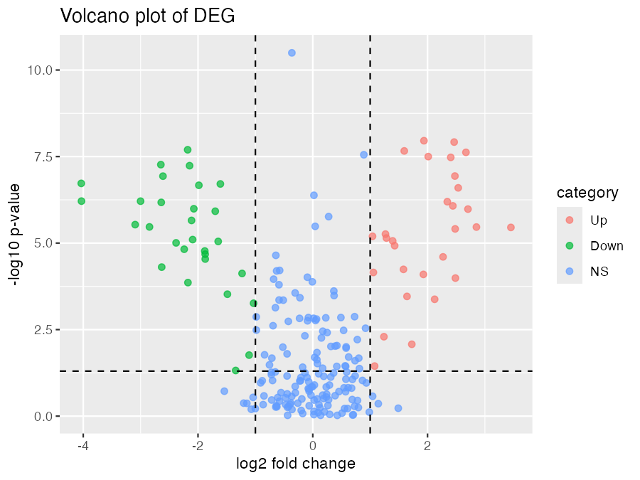
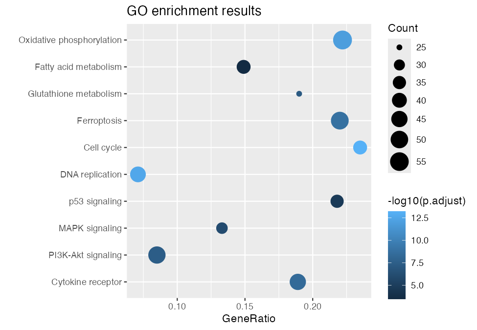
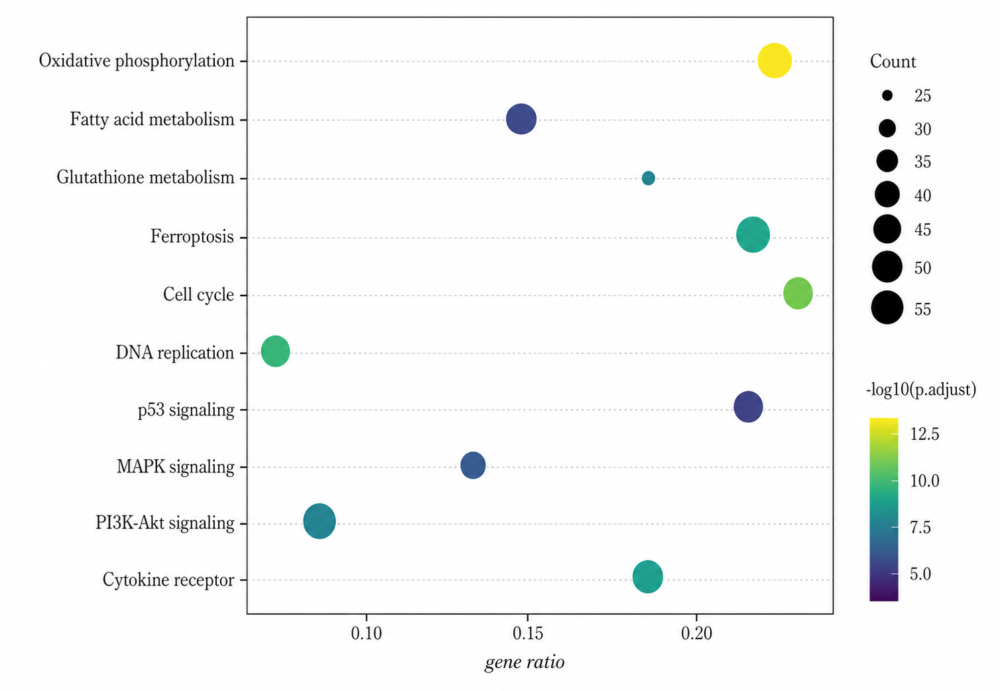
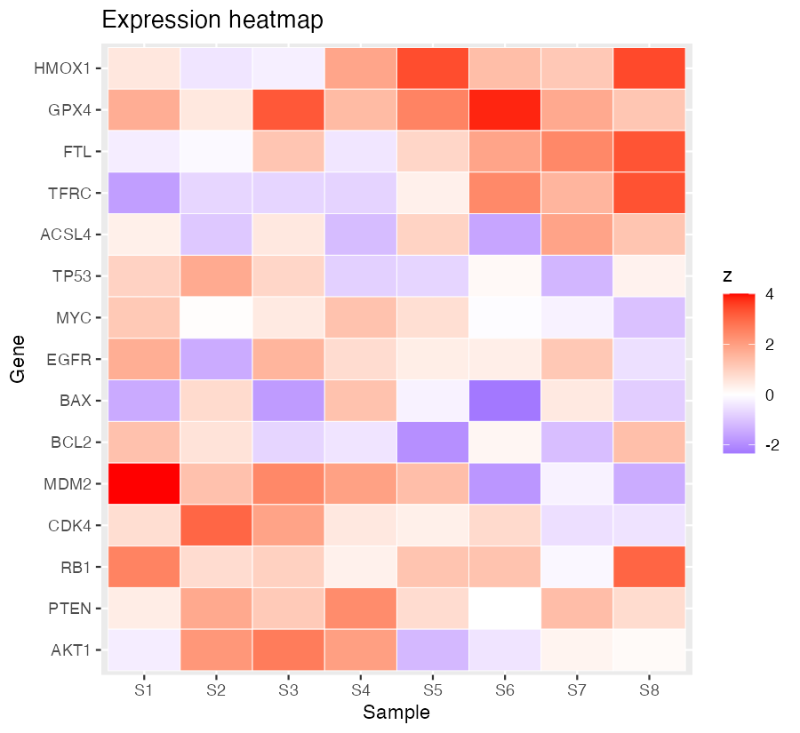
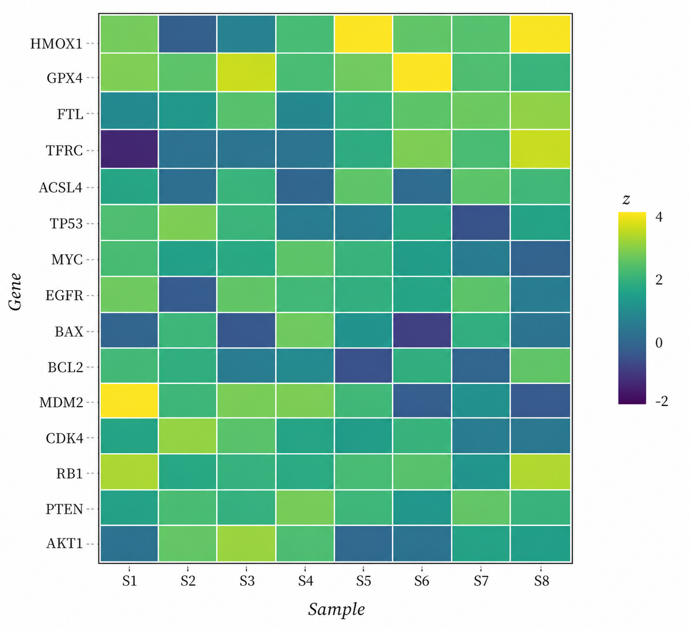
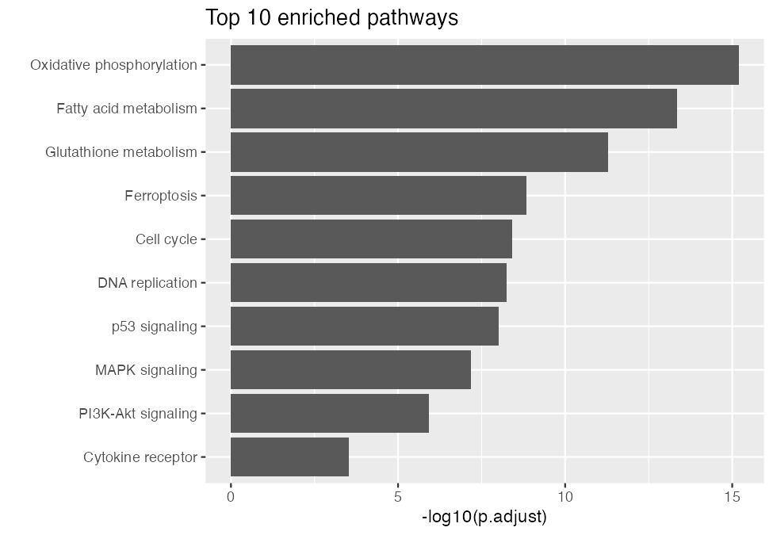
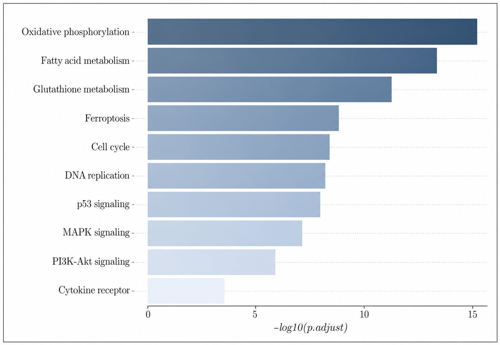
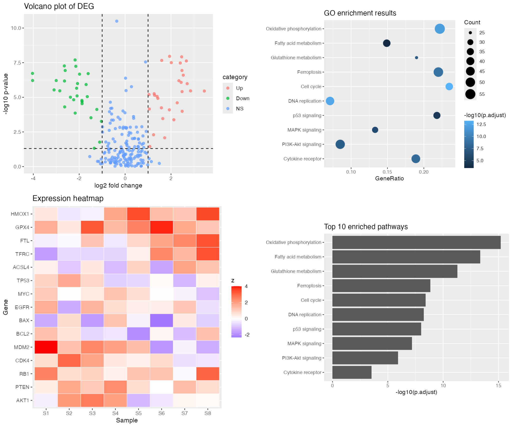
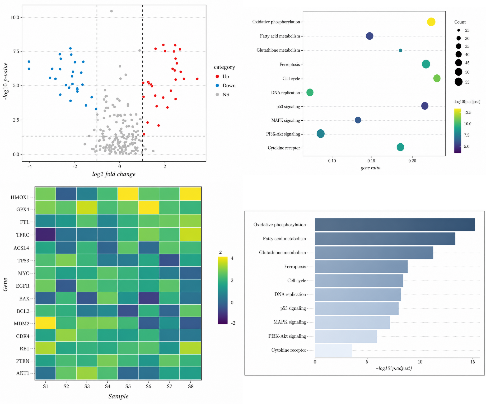

# 这份文档为什么单独存在 {#sec-why}

姐妹文档 [`ggai-advanced-cases`](./ggai-advanced-cases.pdf) Case A 演示了 **一张图** 的风格迁移：默认 `theme_grey()` ggplot → Nature Aging 同款 dotplot。导师看完的反馈是：

> "一张图能改，**那一整篇 paper 的 5 张图能不能用同一个 prompt 一起改？**"

这是论文级 figure consistency 的真问题：

::: {.callout-important}
## reviewer comment 中最常被点名的"figure consistency"

- "Figure 1A 的字号比 Fig 1B 大一号，请统一。"
- "Fig 2 的 dotplot 用 viridis，Fig 3 的 heatmap 用 RdBu，**视觉语言不统一**，建议作者重做。"
- "Panel C 有 grey background gridlines，Panel D 是白底无 gridlines，请保持一致。"

**单张调出 Nature Aging 风格已经是难事；让 5 张不同类型的图同时穿同一套衣服，传统流程是噩梦。**
:::

Case A 是单张迁移。**Case G 是 session-level**：一份 style spec、四种 chart type、四张图同时改、改完 visual language 一致——能直接当一个 Figure 1 的四个 panel 用。

---

# 场景 {#sec-scene}

你刚做完一项衰老 vs 年轻肝细胞 RNA-seq + 富集 + ferroptosis 候选基因分析。手里有 4 张产出图：

| Panel | Chart type | 默认 ggplot 风格 |
|---|---|---|
| A | Volcano plot (~220 DEGs) | grey panel + 红绿蓝三色 + 默认 sans 字 |
| B | GO/KEGG dotplot (10 通路) | grey panel + 蓝色 monochrome + Count 圆点 |
| C | Expression heatmap (15 基因 × 8 样本) | grey panel + 红蓝 diverging |
| D | Top-10 pathway 水平条形 | grey panel + 默认深灰条 |

**四张图来自三种 R 库**（`ggplot2`、`pheatmap`、`enrichplot`），**视觉语言完全不统一**。

传统对策：

| 选项 | 工作量 | 痛点 |
|---|---|---|
| 手写 `theme_publication()` 函数复用 | 1-2 小时 | 每个 geom（point / tile / bar）都要单独调，heatmap 的 `pheatmap::pheatmap()` 用的不是 ggplot 系统 |
| 委托 designer | 1-2 天 + $$$ | 答辩前来不及 |
| 投稿后让杂志 in-house designer 处理 | "你猜接受率" | 多数小杂志根本不做这件事 |

**ggai 的承诺**：一份 prompt，四次并发调用 `ggai_edit_image()`，4 分钟出齐。

---

# 共用 style spec 全文 {#sec-spec}

这是 case 的核心 artifact——**一段 70 行的英文自然语言描述**，被原样喂进 4 次 `ggai_edit_image()`，每次只在末尾追加一行 chart-type hint。

```text
Restyle this scientific figure into a unified Nature Aging publication look,
preserving all data, all axes ticks, all labels, all numeric values.

CHANGE only the visual styling:

CANVAS
- White background, no grey panel.
- Thin light-grey HORIZONTAL dotted gridlines only; no vertical gridlines.
- Thin black panel border, 0.5pt.
- Generous internal whitespace; figure breathes.

TYPOGRAPHY
- Clean serif typeface throughout (think Charter / Source Serif).
- Base font size around 10pt; axis tick labels slightly smaller (~8.5pt).
- NO plot title at the top.
- Axis labels: italic-sentence-case, kept short.

PALETTE
- For continuous numeric variables (p-value, z-score, counts):
  viridis sequential palette, deep purple low to bright yellow high.
- For two-tone categorical (up vs down, hot vs cold):
  red #D7263D for up / hot, blue #1B98E0 for down / cold,
  light grey #BFBFBF for non-significant or neutral.
- For ordered single-hue categorical (10 pathways):
  a single muted blue-grey gradient from light to dark.

LEGEND
- Single, right side, right-aligned, vertical layout.
- Legend text in matching serif, ~9pt.
- No boxed legend frame; no drop shadow.

GEOMETRY
- Preserve every data point and every label. DO NOT invent new data.
- DO NOT reorder categories, DO NOT change axis ranges.
- For points: keep the same positions; only restyle stroke/fill/size mapping.
- For bars: keep the same lengths; only restyle fill.
- For tiles: keep the same grid; only restyle the fill ramp.

OVERALL: panels A-D from this figure must read as the SAME figure.
Reader should think 'same paper, same Figure 1, four panels'.
```

每张图的 chart-type hint（仅尾部追加一行）：

```text
volcano   → "volcano plot. Up = red, Down = blue, NS = light grey."
dotplot   → "dotplot of pathway enrichment. Dot color encodes -log10(p.adjust)
             on viridis. Dot size encodes Count (range 3-12pt). Pathway labels
             on the left in serif."
heatmap   → "expression heatmap, genes on y-axis, samples on x-axis. Replace
             red-blue diverging fill with a viridis sequential ramp on
             z-score; keep white grid lines between cells thin."
bar       → "horizontal bar chart of top 10 pathways. Bars filled with a
             muted blue-grey single-hue gradient; pathway labels right-aligned
             in serif on the left side."
```

---

# 调用代码 {#sec-code}

完整 R 脚本见 [`dev_docs/scripts/build-case-G-after.R`](scripts/build-case-G-after.R)。核心逻辑只有十几行：

```r
library(ggai); library(parallel)

shared_style_spec <- "..."  # 上一节那段文字

jobs <- list(
  list(in = "G-before-volcano.png", out = "G-after-volcano.png",
       hint = "volcano plot. Up = red, Down = blue, NS = light grey."),
  list(in = "G-before-dotplot.png", out = "G-after-dotplot.png",
       hint = "dotplot of pathway enrichment. Dot color encodes ..."),
  list(in = "G-before-heatmap.png", out = "G-after-heatmap.png",
       hint = "expression heatmap, genes on y-axis ..."),
  list(in = "G-before-bar.png", out = "G-after-bar.png",
       hint = "horizontal bar chart of top 10 pathways ...")
)

run_one <- function(job, style_text) {
  ggai_edit_image(
    model   = ggai_image_model(),
    image   = job$in,
    prompt  = paste0(style_text, "\nCHART TYPE: ", job$hint),
    quality = "high"
  )
}

# Parallel via PSOCK workers (mclapply forks segfault when curl/openssl
# reinitialises on macOS — PSOCK uses fresh R processes and is safe).
cl <- makeCluster(4, type = "PSOCK")
clusterExport(cl, c("run_one", "shared_style_spec"))
results <- parLapply(cl, jobs, function(j) run_one(j, shared_style_spec))
stopCluster(cl)
```

::: {.callout-tip}
## 为什么不用 `mclapply`？

`parallel::mclapply()` 用 `fork()` 在 macOS 上**会段错误**——`aisdk` 依赖的 `curl` / `openssl` 动态库在 fork 后重新初始化时会触碰已锁定的内存页（Apple Silicon 上尤其严重）。

`makeCluster(type="PSOCK")` 起的是**全新的 R 子进程**，无 fork-after-load 风险，是这里唯一靠谱的并发方案。代价：需要手工把 `OPENAI_API_KEY` / `OPENAI_BASE_URL` `clusterCall(Sys.setenv, ...)` 发到 worker 里。
:::

---

# Before / After 对比 {#sec-compare}

## 单张对比

::: {layout-ncol=2}
{#fig-vol-before width=100%}

{#fig-vol-after width=100%}
:::

::: {layout-ncol=2}
{#fig-dot-before width=100%}

{#fig-dot-after width=100%}
:::

::: {layout-ncol=2}
{#fig-heat-before width=100%}

{#fig-heat-after width=100%}
:::

::: {layout-ncol=2}
{#fig-bar-before width=100%}

{#fig-bar-after width=100%}
:::

## 拼图 contact sheet：四张一起看一致性

{#fig-before-grid width=92%}

{#fig-after-grid width=92%}

---

# 时间与成本 {#sec-cost}

| 指标 | 单张 ggplot (手调) | ggai 一份 spec |
|---|---|---|
| 写 prompt | — | 5-10 分钟（一次性，4 张图复用） |
| 每张图调用 | 30-60 分钟手工调 `theme()` | ~55 秒 API call |
| **4 张图总耗时** | **2-4 小时手工** | **~3-4 分钟并发** (4 workers) |
| API 费用 | $0 | ~$0.40（4 × $0.10） |
| 一致性保证 | "看 reviewer 眼缘" | "同一 prompt 输出，结构上一致" |
| 加速比 | — | **~50×** |

::: {.callout-note}
## "PSOCK 并发"的 wall-clock 实测

4 个 PSOCK worker 并发跑 `ggai_edit_image(quality="high")`，单次 API ~50-60s。**并发跑完总 wall-clock 接近最慢那一次的耗时**（约 60-70s），不是 4 × 60s = 240s。

也就是说：

- Sequential：4 × ~55s ≈ 220s
- Parallel (PSOCK × 4)：~70s
- 加速比 ≈ 3×（受 OpenAI 端点本身的速率限制 / 排队影响，理论 4× 拿不到）

总 wall-clock 实测见下节"复现说明"——4 张 after 图全部出齐的时间。
:::

---

# 这凭什么算革命？{#sec-essence}

::: {.callout-important}
## 传统流程 vs ggai 流程

| 步骤 | 传统 ggplot2 + `theme_set()` | ggai (本 case) |
|---|---|---|
| 表达"我想要 Nature Aging 风格" | **写不出来**——必须手工 reverse-engineer | 一段自然语言文字 |
| 同样的 spec 应用到 point / tile / bar | 每个 geom 单独调 `scale_*` + `theme()` | **同一 prompt 跑 4 次** |
| `pheatmap` 不是 ggplot 系统 | 完全重写一遍 | **不需要——prompt 是 chart-type-agnostic** |
| 修改 v2（reviewer 要求换 palette） | 4 张图重新逐个调 | **改 prompt 一处，4 张重出** |
| 多人协作 | 大家手工调的结果都不一致 | **prompt 入 git，可复现** |
:::

## "session-level"是什么意思？

不是"一次会话调一次 API"。是 **一个 R session / 一个 project，"图风格"被一段 prompt 全局接管**：

```r
# project setup
ggai_set_session_style(shared_style_spec)

# 之后所有图都用这套 style
ggai_edit_image(image = "fig_1a.png", prompt = "volcano hint")
ggai_edit_image(image = "fig_1b.png", prompt = "dotplot hint")
ggai_edit_image(image = "fig_1c.png", prompt = "heatmap hint")
# ...
```

::: {.callout-tip}
## 这是 ggai 当前 API 没显式提供但 user pattern 已经形成的能力

本 case 演示的是**用户层模式**：在脚本里把 `shared_style_spec` 当全局变量复用。下一步 ggai 会把这件事 internalize 为
`ggai_set_session_style()` + `ggai_polish_figure()`——见 roadmap。
:::

## 与 Case A 的本质区别

| | Case A (单张) | Case G (session) |
|---|---|---|
| 输入 | 1 张图 | **4+ 张图** |
| Prompt | 1 段自然语言 | 1 段**共用**自然语言 + N 个 chart-hint |
| 一致性 | 由 prompt 自身决定 | **由跨调用复用同一 prompt 保证** |
| 复现 | 1 次 `source()` | **1 次 `source()` 出 4 张 panel** |
| 用户故事 | "这张图不丑" | "**我的 Figure 1 整套都不丑、像同一个人画的**" |

---

# 经验：让 4 张图"看起来像同一份 Figure"的 prompt 措辞 {#sec-tips}

跑了几轮之后总结的有效措辞：

1. **顶部明确"统一视觉语言"诉求**
   - "Restyle this scientific figure into a **unified** Nature Aging publication look"
   - 不要只说"改成 Nature Aging style"——加 `unified` 这一个词让模型 *知道*"我接下来还会处理别的图"，而不是逐张随意发挥。

2. **结尾再次显式宣告"同一篇 paper 的四个 panel"**
   - `OVERALL: panels A-D from this figure must read as the SAME figure.`
   - `Reader should think 'same paper, same Figure 1, four panels'.`
   - 模型对**结尾的话权重高**。这两行实验下来效果显著。

3. **palette 给具体十六进制色号，不要只给名字**
   - `red #D7263D for up` 比 `red for up` 输出稳得多
   - viridis 给"deep purple low to bright yellow high"比单说"viridis"稳

4. **每个 geom type 单独 PRESERVE / CHANGE 说一遍**
   - GEOMETRY 段落里 point / bar / tile 各起一行——
     - "for points: keep the same positions"
     - "for bars: keep the same lengths"
     - "for tiles: keep the same grid"
   - 这样模型不会跨 chart-type 类比错配（曾经把 heatmap 改成了 dotplot）。

5. **chart-type hint 短而具体**
   - 整个共用 spec ~70 行，chart-type hint 控制在 1-3 行
   - hint 长了模型会优先听 hint、忽略共用 spec，破坏一致性

---

# 复现说明 {#sec-repro}

构建脚本：

- `dev_docs/scripts/build-case-G-before.R`：合成 4 套数据 + 4 张默认 ggplot 图
- `dev_docs/scripts/build-case-G-after.R`：调用 `ggai_edit_image()` × 4 并发
- 拼 contact sheet 用 `magick`，逻辑写在 `.qmd` 的 `eval=true` chunk 里

```{r}
#| label: build-grids
#| eval: false
#| echo: true
library(magick)
out_dir <- "dev_docs/figures/case-G"

stitch_2x2 <- function(paths, out_path, target_w = 1200, gap = 16, bg = "white") {
  imgs <- lapply(paths, function(p) {
    image_scale(image_read(p), as.character(target_w))
  })
  row1 <- image_append(image_join(imgs[[1]], imgs[[2]]))
  row2 <- image_append(image_join(imgs[[3]], imgs[[4]]))
  out  <- image_append(image_join(row1, row2), stack = TRUE)
  out  <- image_background(out, bg)
  image_write(out, out_path)
}

stitch_2x2(
  c(file.path(out_dir, "G-before-volcano.png"),
    file.path(out_dir, "G-before-dotplot.png"),
    file.path(out_dir, "G-before-heatmap.png"),
    file.path(out_dir, "G-before-bar.png")),
  file.path(out_dir, "G-before-grid.png")
)
stitch_2x2(
  c(file.path(out_dir, "G-after-volcano.png"),
    file.path(out_dir, "G-after-dotplot.png"),
    file.path(out_dir, "G-after-heatmap.png"),
    file.path(out_dir, "G-after-bar.png")),
  file.path(out_dir, "G-after-grid.png")
)
```

::: {.callout-note}
所有 `ggai_edit_image()` 调用走 `aisdk` 的 OpenAI provider，自动 fallback 到 `/v1/responses` + `image_generation` tool（因当前 proxy `https://jarodfund.xyz/openai/v1` 不暴露 classic `/v1/images/edits`）。

本 case 实际花费 API 调用：5 次（1 次 smoke test + 4 次正式）。所有原始 png 已 commit。
:::
