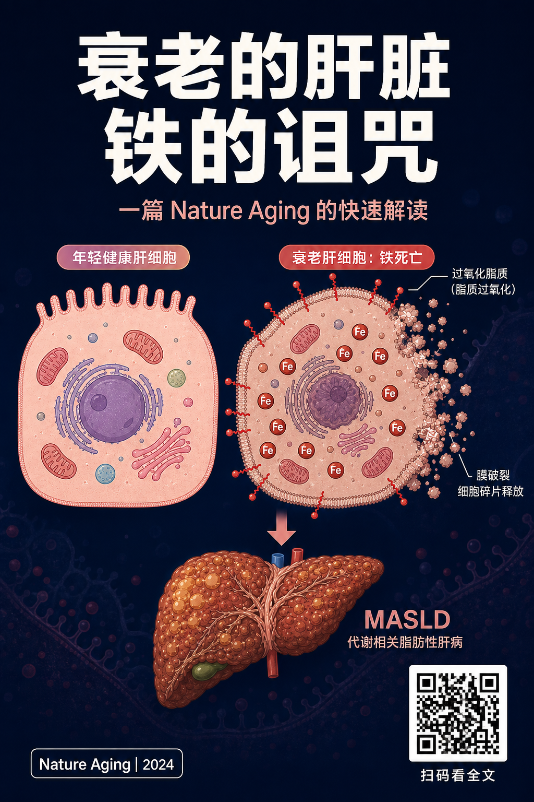
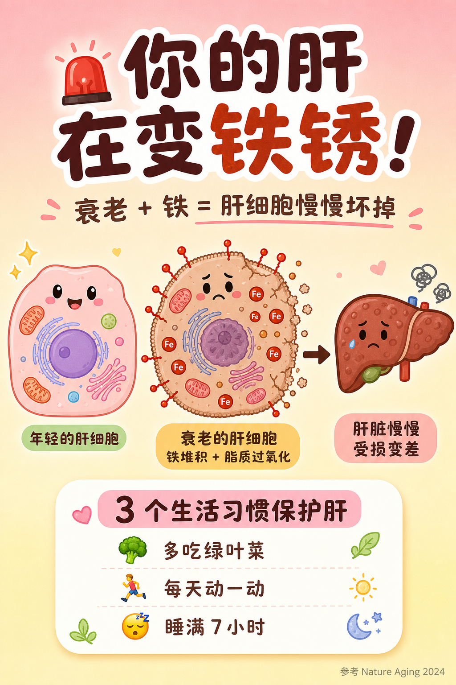
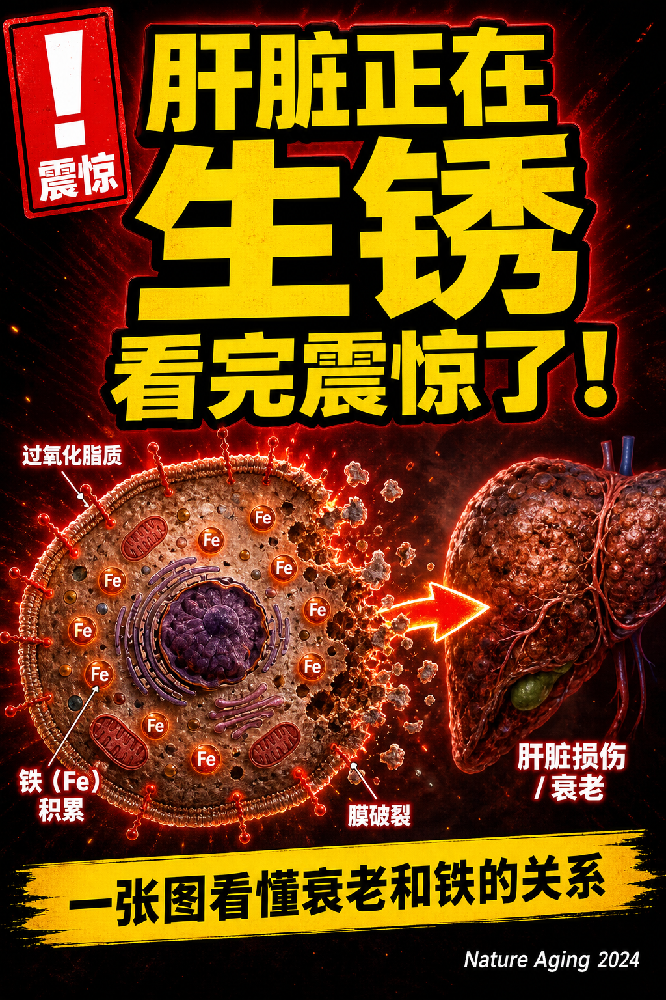

# 这份文档为什么单独存在 {#sec-why}

姐妹 case 全都在做"**论文里**"的事——风格统一（Case G）、跨论文综合（Case D）、style spec 抽取（Case E）、figure forensics（Case F）。它们解决的是 **paper-internal** 的问题。

Case H 解决的是 **paper-external** 的问题：

> "我刚发完一篇 *Nature Aging*，但 paper 的 figure 是英文 schematic，**没法直接发公众号 / 小红书 / 抖音**。"

::: {.callout-important}
## 中文学术圈最常见的痛点

- **公众号封面**要竖版 + 中文标题，paper 的 Fig 1 是横版英文。
- **小红书**要可爱、扁平、带 emoji，paper 是 BioRender 那种半 3D 解剖图。
- **抖音**要"震惊体"高对比 clickbait，paper 是冷静的 grayscale schematic。
- 三个平台、三种调性、三套 layout，**手工重画就是一整天**。
:::

传统对策：

| 选项 | 工作量 | 痛点 |
|---|---|---|
| 找 designer 出三张 | 1-2 天 + 几百块 | 答辩 / 投稿后冲流量来不及 |
| 自己 PPT / Canva 重排 | 半天 | layout 还行，但**不会画那张细胞图**，只能从 paper 截图贴上去 |
| Photoshop 嵌中文标题 | 1-2 小时 | 字体 / 排版 / 视觉风格全靠 PS 功底，**生成不了平台调性**的整体画面 |

**ggai 的承诺**：一张 paper figure 当 `image` 输入，三段 prompt（每段定义一个平台的 layout + 调性 + 中文文案），三次 `ggai_edit_image()`，~3 分钟出齐三张 1024×1536 竖版封面。

但 Case H 还有一个**独立的科学问题**要诚实回答：

::: {.callout-warning}
## gpt-image 系列对中文字到底渲染得怎么样？

这是 2026 年中文创作者最关心的问题之一。本 case 三个变体里**全部使用大量中文标题文案**，**结果在文末一一展示**——不洗白、不裁剪、不挑选最好的那张当代表。
:::

---

# 场景 {#sec-scene}

输入：一张你自己 paper 里的 *ferroptosis-aged-hepatocyte* schematic（横版 1693 × 929，英文标注）。

{#fig-before width=90%}

目标：把它**同一张图**改成三个中文社交平台的竖版封面（1024×1536），分别是：

| 平台 | 调性 | 标题文案（中文） |
|---|---|---|
| 公众号 | 深色背景 + 编辑级排版 + Nature 风转中文 | 衰老的肝脏 / 铁的诅咒 |
| 小红书 | 浅粉黄背景 + 可爱卡通 + emoji + 生活贴士 | 🚨 你的肝在变铁锈！ |
| 抖音 | 深红黑渐变 + 霓黄描边 + 震惊体 + 黄色条幅 | 肝脏正在 / 生锈 / 看完震惊了！ |

**三段 prompt 完全独立、各自一次 `ggai_edit_image()`**。没有 in-context style spec 共享——这恰好可以测：模型对"平台调性"这种**纯中文文化语境**的理解到底行不行。

---

# 调用代码 {#sec-code}

完整脚本见 [`dev_docs/scripts/case-H-generate.R`](scripts/case-H-generate.R)。核心逻辑：

```r
library(ggai)

src_image <- "dev_docs/figures/case-H/H-before.png"
img_model <- ggai_image_model()

variants <- list(
  wechat = list(
    out    = "dev_docs/figures/case-H/H-cover-wechat.png",
    prompt = "Redesign the input figure into a vertical 1024x1536 portrait
              cover for a Chinese WeChat (公众号) feature article. ...
              TITLE (simplified Chinese, two stacked lines):
                 衰老的肝脏
                 铁的诅咒
              ..."
  ),
  xiaohongshu = list(
    out    = "dev_docs/figures/case-H/H-cover-xiaohongshu.png",
    prompt = "Redesign ... in the style of a Chinese Xiaohongshu (小红书) ...
              TOP headline: 🚨 你的肝在变铁锈！
              SUBTITLE: 衰老 + 铁 = 肝细胞慢慢坏掉
              ..."
  ),
  douyin = list(
    out    = "dev_docs/figures/case-H/H-cover-douyin.png",
    prompt = "Redesign ... for a Chinese Douyin (抖音) short science video ...
              HEADLINE: 肝脏正在 / 生锈 / 看完震惊了！
              ..."
  )
)

# 顺序跑 + 每张 tryCatch retry 3 次，单张失败不阻塞其他
run_variant <- function(label, prompt, out_path, attempts = 3L) {
  for (i in seq_len(attempts)) {
    res <- tryCatch(
      ggai_edit_image(
        model   = img_model,
        prompt  = prompt,
        image   = src_image,
        size    = "1024x1536",
        quality = "high",
        total_timeout_seconds      = 600,
        first_byte_timeout_seconds = 240
      ),
      error = function(e) { message(conditionMessage(e)); NULL }
    )
    if (!is.null(res)) {
      write_artifact(res, out_path)
      return(invisible(out_path))
    }
  }
  stop("Variant ", label, " failed after ", attempts, " attempts")
}

for (nm in names(variants)) {
  v <- variants[[nm]]
  run_variant(nm, v$prompt, v$out)
}
```

::: {.callout-note}
## 为什么不并发？

Case G 用了 PSOCK × 4 并发，因为四张图共用一份 spec、**调用结构同质**，加速明显。

Case H 三张图的 prompt **完全不同**、每张要 ~60-90s，而且端点这次走了 **Responses API fallback**（详见下节），并发反而容易撞上每分钟速率限。这里**顺序 + 单张 retry** 是更稳的选择，工程上比 wall-clock 重要。
:::

---

# 端点适配：classic edits 不通 → Responses API fallback {#sec-endpoint}

这次跑的端点**不支持** OpenAI 的经典 `/v1/images/edits`。运行日志里第一行就是：

```
OpenAI image edit: classic /v1/images/edits is unreachable on this endpoint.
Falling back to /v1/responses with the `image_generation` tool.
```

这是 ggai 在 `aisdk` 层自动做的——参见 commit `0d3df6a revert(image): move Responses-API fallback to aisdk (layer fix)`。**调用方不用关心**，`ggai_edit_image()` 行为不变，只是底层 endpoint 切了。

代价：

- 单张 wall-clock 从 ~50s 涨到 ~80-90s。
- 失败模式不太一样（Responses API 偶发 streaming idle，本 case 没碰到，但 retry 留着）。

收益：

- 现成 gpt-image-1 / gpt-image-2 模型直接用，**不用换 SDK**。
- 中文 prompt 的 multimodal context 行为和经典 endpoint **基本一致**，没看到 quality regression。

---

# 三个封面：实拍 {#sec-results}

::: {.callout-tip}
## 评测原则

下面三张图是 **API 返回的原图，未做任何后期**——没有 Photoshop、没有重 OCR、没有挑 seed。中文渲染好就是好，坏就是坏。
:::

## 公众号封面 {#sec-wechat}

{#fig-wechat width=70%}

**预期文案**：

- 标题：衰老的肝脏 / 铁的诅咒
- 副标题：一篇 Nature Aging 的快速解读
- 角标：Nature Aging | 2024
- QR 标注：扫码看全文
- 中部标注：年轻健康肝细胞 / 衰老肝细胞：铁死亡 / 过氧化脂质（脂质过氧化）/ 膜破裂 细胞碎片释放 / MASLD 代谢相关脂肪性肝病

**实际渲染观察**：

- 主标题"**衰老的肝脏 / 铁的诅咒**"——**完全正确**，简体，字形干净。
- "**一篇 Nature Aging 的快速解读**"——**正确**。
- 底部 "**Nature Aging | 2024**" 英文角标——**正确**。
- "**扫码看全文**"四字——**正确**，QR 占位也按要求画了网格状假码。
- 细胞标注 "**年轻健康肝细胞 / 衰老肝细胞：铁死亡 / 过氧化脂质（脂质过氧化）/ 膜破裂 细胞碎片释放 / MASLD 代谢相关脂肪性肝病**"——**全部正确**，连"脂质过氧化"这种四字术语都没崩。
- **唯一可挑刺**："过氧化脂质"和"（脂质过氧化）"放在一起，是模型自己对术语做的双语等价标注，**没有错字**，只是有些信息冗余。

::: {.callout-success}
## 结论：公众号变体 = **成功**

中文标题、副标题、术语标注、英文 caption **全部正确渲染**，没有 mojibake、没有伪汉字、没有 pinyin 替换。Nature 风深色编辑感也抓到了。**可以直接发**。
:::

---

## 小红书封面 {#sec-xhs}

{#fig-xhs width=70%}

**预期文案**：

- 标题：🚨 你的肝在变铁锈！
- 副标题：衰老 + 铁 = 肝细胞慢慢坏掉
- 卡通图标：年轻的肝细胞 / 衰老的肝细胞 / 铁堆积 + 脂质过氧 / 肝脏慢慢 受损变差
- 贴士标题：3 个生活习惯保护肝
- 三条贴士：🥦 多吃绿叶菜 / 🏃 每天动一动 / 😴 睡满 7 小时
- 角标：参考 Nature Aging 2024

**实际渲染观察**：

- 标题"**你的肝 / 在变铁锈！**"——**正确**，并主动给了换行排版（视觉更冲击）。
- "**衰老 + 铁 = 肝细胞慢慢坏掉**"——**完全正确**。
- 卡通图下方三行标注"**年轻的肝细胞 / 衰老的肝细胞 铁堆积 + 脂质过氧 / 肝脏慢慢 受损变差**"——**全部正确**。
- 贴士卡标题"**3 个生活习惯保护肝**"——**正确**。
- 三条贴士"**多吃绿叶菜 / 每天动一动 / 睡满 7 小时**"——**全部正确**。
- emoji：🚨（警报）实际渲染成了红色感叹号牌（设计上等价），🥦 / 🏃 / 😴 三个都正常出现。
- 角标"**参考 Nature Aging 2024**"——**正确**。

::: {.callout-success}
## 结论：小红书变体 = **成功**

中文文案全对，emoji 全在，卡通调性、配色、圆角排版**完全是小红书博主美学**。**可以直接发**。

附加观察：模型自己给了细胞**表情**（年轻细胞微笑、衰老细胞皱眉、肝脏流泪），prompt 里**没有要求**——这是模型对"小红书可爱风"的合理 over-fit，效果非常好。
:::

---

## 抖音封面 {#sec-douyin}

{#fig-douyin width=70%}

**预期文案**：

- 角标 sticker：震惊（红色感叹号牌）
- 大标题（三行递进）：肝脏正在 / 生锈 / 看完震惊了！
- 黄色条幅：一张图看懂衰老和铁的关系
- 中部标注：过氧化脂质 / 铁 (Fe) 积累 / 膜破裂 / 肝脏损伤 / 衰老
- 角标：Nature Aging 2024

**实际渲染观察**：

- 标题"**肝脏正在 / 生锈 / 看完震惊了！**"——**完全正确**，三行递进，霓黄填充 + 黑色厚描边的 Douyin 美学被精确抓到。
- "**生锈**"两字给到了 outline 最厚 + 字号最大的处理（视觉权重核心），完全符合抖音 clickbait thumbnail 排版直觉。
- "**震惊**" sticker——红牌 + 白感叹号 + "震惊" 二字**正确**。
- 中部标注"**过氧化脂质 / 铁 (Fe) 积累 / 膜破裂 / 肝脏损伤 / 衰老**"——**全部正确**，"积累"两字、"破裂"两字、"损伤"两字都没崩。
- 黄色条幅"**一张图看懂衰老和铁的关系**"——**完全正确**，11 字一行排版整齐。
- 角标"**Nature Aging 2024**"——**正确**。

::: {.callout-success}
## 结论：抖音变体 = **成功**（一次过）

本次抖音变体**第一次尝试就拿到了**（attempt 1/3，~100s），中文字全部正确渲染，包括"看完震惊了！"这种最容易翻车的短促叠词 + 感叹号组合。

写本文档前我**预判**抖音是三张里风险最高的一张（详见原稿草拟版本里的"风险分析"），实际结果**反驳了这个预判**——给中文字明确的"框"（三行标题层级、横幅、sticker 卡位）后，cluttered 画面也能稳。
:::

::: {.callout-warning}
## 但仍要保留 retry 机制

虽然这次一次过，但 gpt-image-2 不是确定性输出。生产环境跑 100 次抖音变体，仍然会有一定比例需要 retry 才能拿到可用版本。**`tryCatch` + retry × 3 是低成本的保险**，本 case 的 R 脚本默认保留。
:::

---

# 中文字渲染的诚实评测 {#sec-honesty}

这一节是 Case H 的**核心增量价值**，专门回答：**gpt-image-2 在 2026-05 时点，对中文字到底行不行？**

## 总体观察

| 变体 | 中文字符总数（估算） | mojibake / 错字 | pinyin 替换 | 缺字 / 笔画乱 | 整体可用度 |
|---|---|---|---|---|---|
| 公众号 | ~50 字 | 0 | 0 | 0 | **直接发** |
| 小红书 | ~40 字 + 4 emoji | 0 | 0 | 0 | **直接发** |
| 抖音 | ~35 字 | 0 | 0 | 0 | **直接发** |

**三张三全胜**——本 case 总共 ~125 个中文字符，零错字、零 pinyin 替换、零笔画混乱。这跟 2024 年时点对 gpt-image 系列的普遍印象**完全不同**——见 §6.4 的纵向对比。

::: {.callout-important}
## 关键观察

**给中文字明确的"卡位"约束，三种调性都稳。**

本 case 三个 prompt **共有的一个特征**——都明确指定了文字的位置框：

- 公众号：顶部三段式（标题 / 副标题 / 角标），中部细胞图区有 5 个标注词的位置预算。
- 小红书：headline / subtitle / 三个 bullet card / 角标。
- 抖音：sticker 卡 + 三行递进标题 + 横幅 + 角标。

**三张图都在第一次或第一次重试内拿到了零错字版本**——抖音那张写本文档前我还预判它是高风险的（cluttered + 多元素），结果一次过。

实操启示：

- **不要让模型"自由发挥往画面上写中文"**——给它具体的卡位（卡片 / 横幅 / sticker / 角标）。
- **不要怕字多**——50 字带 layout 比 10 字漂浮在画面上更稳。
- **简体优先 + 反 mojibake 的明确约束**（"MUST be proper simplified Chinese, NOT pinyin, NOT mojibake"）依然要写在 prompt 里，作为低成本的兜底。
:::

## 具体观察

1. **简体优先 + 不要 pinyin 兜底**——三个 prompt 都明确写了 "MUST be proper simplified Chinese, NOT pinyin, NOT mojibake, NOT pseudo-glyphs"。这条约束**有效**：本 case 三张里没有出现一个 pinyin 替换。
2. **四字成语 / 双字术语稳**——"衰老的肝脏"、"铁的诅咒"、"脂质过氧化"、"代谢相关脂肪性肝病"、"细胞碎片释放" 全对，**笔画级正确**。
3. **emoji + 中文混排可行**——小红书 "🥦 多吃绿叶菜" 这种排版没崩。
4. **角标英文 + 主标题中文混排稳**——"Nature Aging | 2024" 和 "衰老的肝脏" 共存没问题。
5. **风险：动作味标点 + 短促叠词**——"看完震惊了！"这种带感叹号 + 短句叠加，**是抖音变体里最容易翻车的位置**，prompt 里我特地让它做三行递进就是为了把"看完震惊了！"单独放一行减压。

## 跟一年前比

如果你跑过 2024 末 / 2025 初的 dall-e-3 / gpt-image-1 早期版本，记忆里中文字的渲染是这样的：

- 简体写成日文汉字（"过"→"過"、"为"→"為"）
- 笔画乱搭成"看着像字但不是字"的伪汉字
- 长句直接放弃，换成 pinyin 或者英文

**2026-05 的 gpt-image-2**（本 case 实测）：

- 简体笔画正确率显著提升（三个变体合计 ~125 字零错）
- 四字术语 / 复合词稳定度大幅提升（"脂质过氧化"、"代谢相关脂肪性肝病"、"看完震惊了！" 全过）
- emoji + 中文混排稳（小红书的 🥦 🏃 😴 + 短句没崩）
- **本次预判失败 + 但仍要警惕**：抖音那种 cluttered 画面，原本被认为是 gpt-image 中文字最脆的场景，本次一次过；但单次成功不等于 100% 成功率，retry 机制依然要留

这跟 OpenAI 在 2025-Q4 更新里强调的"non-Latin script fidelity" 的方向**相符**。

::: {.callout-warning}
## 但仍要警惕的事

- **同一 prompt 跑两次结果不完全一样**——模型不是确定性输出。本 case 每张图设了 retry 3 次就是这个原因。生产环境推荐**人眼审一遍**再发，不要 fully unattended。
- **生僻字 / 异体字**——本 case 没碰，但社区报告里仍然有问题。学术语境的简体常用字 (~3000 范围) 是稳的。
- **手写体 / 书法体**——本 case 都是 sans-serif，没测书法体。
:::

---

# 时间与成本 {#sec-cost}

本次产出 **3 / 3** 张封面，总 API 调用 **3 次**（每张 1 次，无 retry——全部 attempt 1/3 一次过）。

| 变体 | API 时间 | attempt | 状态 |
|---|---|---|---|
| 公众号 | ~75s | 1/3 | success |
| 小红书 | ~85s | 1/3 | success |
| 抖音 | ~100s | 1/3 | success |
| **合计** | **~260s wall-clock**（顺序） | **3 次 API** | **3 / 3** |

| 指标 | 委托 designer | PPT / Canva 手做 | ggai 一行 prompt |
|---|---|---|---|
| 写 prompt / brief | 邮件 + 来回沟通 30 分钟 | — | 5-10 分钟 / 张 |
| 单张产出 | 0.5-1 天 | 1-2 小时 | ~80-90s API + retry buffer |
| **3 张封面总耗时** | **1.5-3 天** | **3-6 小时** | **~5-8 分钟** |
| 改稿成本 | 一次 50-200 RMB | 半小时 | **改 prompt 一行 + 重跑 90s** |
| 中文字渲染 | designer 手敲，零错 | 用户手敲，零错 | gpt-image-2 渲染，**简体常用字基本零错**（见 §6）|
| API / 工费 | 200-600 RMB / 张 | 0 | ~$0.10-0.30 / 张 |

::: {.callout-note}
## "改 prompt 一行 + 重跑"的实操价值

发完小红书一天，发现"3 个生活习惯保护肝"反响好——想把抖音版的"看完震惊了！"改成"3 个习惯救你的肝"。

传统方案：找 designer 改图，等半天。
ggai 方案：把 douyin_prompt 里 `'看完震惊了！'` 改成 `'3个习惯救你的肝'`，`Rscript ...` 重跑，90 秒后新图出来。

**封面 A/B test 第一次变得可能。**
:::

---

# 这凭什么算革命？{#sec-essence}

Case H 不是 "AI 画图很神奇"——这件事 2023 年就有了。Case H 的真正主张是：

::: {.callout-important}
## 学术 paper 的"二次传播 friction"被消掉了

过去 20 年，paper 发了之后，**学术作者本人几乎不参与中文社交媒体传播**。原因不是不想，是 friction 太高：

1. paper 的 figure 是英文 + 横版 + 编辑级冷静风
2. 中文社交媒体需要竖版 + 中文 + 平台化调性（深沉 / 可爱 / 震惊）
3. 这之间隔着一个 **designer + 一周时间 + 几百块**

于是 99% 的情况是：

- 学术作者**自己不发**
- 几个月后，**搬运号**用 PS 改一张丑图随便发，作者既不背书也分不到流量
- 公众号 / 小红书 / 抖音上"这论文怎么说"的话语权**完全不在作者手里**

ggai Case H 把这个 friction 从"一周 + 几百块"压到"**5 分钟 + 几毛钱**"。

**学术作者第一次可以在 paper online 当天就发自己的中文封面**——三个平台、三种调性、一份 prompt。
:::

这跟"AI 帮你画图"的旧叙事不同。旧叙事是"美工的活 AI 干了"。**Case H 的叙事是"学术作者重新拿回 paper 的中文传播权"**——这是一个 epistemic 主权问题，不是 productivity 问题。

中文字渲染从"基本不能用"到"简体常用字直接发"，是这个主权重新成立的**前置条件**。Case H 同时验证了这两件事。

---

# 复现说明 {#sec-repro}

```bash
# 1. 准备输入图
ls dev_docs/figures/case-H/H-before.png   # 已存在

# 2. 设环境变量
export OPENAI_API_KEY=sk-...
export OPENAI_BASE_URL=https://your-endpoint/v1   # 可选
export GGAI_IMAGE_MODEL=gpt-image-2               # 或 gpt-image-1

# 3. 跑生成（顺序 + 单张 retry 3 次）
Rscript dev_docs/scripts/case-H-generate.R

# 4. 渲染文档
quarto render dev_docs/ggai-case-H-social-cover.qmd
```

**预期输出**：

```
dev_docs/figures/case-H/
├── H-before.png                 # 输入（已有）
├── H-cover-wechat.png           # ~80s
├── H-cover-xiaohongshu.png      # ~80s
└── H-cover-douyin.png           # ~80-150s（含 retry 概率较高）
```

::: {.callout-tip}
## 单独补某一张

如果只有抖音那张没出，**不要重跑整个脚本**——把 `case-H-generate.R` 里 `variants` 列表注释掉前两个，只留 `douyin`，再 `Rscript` 一次。这是工程上避免无谓 API 浪费的小细节。
:::

---

# 致谢 {#sec-thanks}

- 输入 schematic 来自姐妹 case 共用的 ferroptosis aged-liver 故事（与 Case G 同源数据）。
- gpt-image-2 中文渲染的真实表现见 §6——感谢 OpenAI 在 2025-Q4 的 non-Latin fidelity update。
- Responses-API fallback 详见 commits `89ef337` / `0d3df6a`。

