# 背景：科研做图的真实痛点 {#sec-background}

## 现状：两套割裂的 workflow

在我们课题组的日常里，一篇文章/一次组会的图大致来自两条互不相通的产线：

| 产线 | 工具 | 输出 | 复用性 |
|---|---|---|---|
| **数据图** | `ggplot2` / `ComplexHeatmap` / `circlize` / `Seurat::DimPlot` | 火山图、UMAP、heatmap、circos | 高（R 代码 = 可复现）|
| **概念图** | BioRender / Illustrator / PowerPoint | 信号通路、机制示意、figure 1 的 cartoon | 低（拖拽产物，不可参数化）|

两条线分别有各自的痛：

**数据图侧**——一张 publication-ready 的 figure 1 经常要在 ggplot 主题、字体、配色、面板对齐、`patchwork::wrap_plots()` 行高列宽之间反复磨。一个老手大约 1–3 小时一张主图；新人面对 facet + 双 y 轴 + 嵌套 legend 时常常卡半天。

**概念图侧**——BioRender 有 1000+ 个 cell/molecule asset，但**它们都是被 BioRender 团队预制好的**。要画一个 BioRender 没有的细胞类型、一个特殊形状的细胞器、一个非典型的信号回路，要么放弃，要么去 Illustrator 手画。每篇文章 figure 1 的 cartoon 都要重新拼一次，**前一篇的 layout 几乎没法继承**。

## AI 图像模型成熟，但还没真正进入 R 生信 workflow

`gpt-image-2`、`Imagen 3`、`Stable Diffusion XL` 这一代图像模型已经能稳定产出 BioRender-style 的细胞、组织、信号通路示意图。但要把它真正用上：

- **Prompt engineering 门槛**——一句"画一个 T 细胞"得到的是科幻插画，不是科研示意；要写出"stylized activated T cell, rounded membrane with receptor details, scientific figure illustration, biorender-style, isolated subject cutout"才出对的东西
- **模型 quirk 大量隐藏**——例如 `gpt-image-2` 静默忽略 `background=transparent` 参数，你以为是透明背景，实际是白底
- **R 集成空白**——目前主流方案是去网页/curl 调 API，再人工把图拖回 R，无法和 ggplot 流水线结合
- **没有领域知识沉淀**——"画肿瘤细胞"应该是什么 style、应该多大分辨率、negative prompt 要写什么——没人替你管理这些

## 一句话定位

`ggai` 把 AI 模型当作**做图助手**：研究者用自然语言描述意图，工具自主组合**数据图能力**（ggplot / ComplexHeatmap / circlize / patchwork / htmlwidget）+ **图像生成能力**（chroma-key cutout / direct figure / reference-based polish）+ **领域知识**（13 个内置 skill，覆盖单细胞、空间转录组、heatmap、circos、biomedical entity 等），最后吐出 R 代码 + 渲染图 + 验证报告。

::: {.callout-tip}
## 想直接看真实科研案例？

如果你想跳过架构细节，直接看 **ggai 在真实生信论文场景下能做什么**——4 个深度案例（教育 / 单细胞+空间组 / 衰老机制 / multi-omics composite，全部基于课题组 `final_library/` 的 41 篇高影响力文献）位于 [@sec-cases]。所有图均由 `gpt-image-2` 在 2026-05-18 真实生成。
:::

---

# 定位与设计哲学 {#sec-philosophy}

## 反面教材：预编程业务函数（pre-baked wrappers）

`ggai` v0 时期曾经走过这样的路：

```r
# v0 思路：每加一种业务场景就加一个函数 + 一份 preset 表
bio_asset_spec("tumor_cell")              # 预制好的 7 个细胞类型
generate_bio_asset(spec)                  # 多次尝试 + 写死的质量打分
ggdiagram(width = 10, height = 6)         # 预制好的 diagram canvas
glyph_ai(prompt = "cell icon")            # 预制好的 glyph 生成 wrapper
```

这种设计本质上是 **BioRender 困境的代码版**——课题组的需求一变，就要回到代码里加新 preset、新 wrapper。我们做的不是"让工具自适应"，而是"穷举可能的场景"。

清理这层后，剩下的全是 **agent 可以自由组合的原子能力**。

## 三层抽象

`ggai` 的设计可以一句话概括：

> **原子能力**（atomic capabilities）+ **领域知识**（skill markdown）+ **Agent 决策环**（agent loop）

```{mermaid}
%%| label: fig-three-layer
%%| fig-cap: "ggai 三层抽象：能力、知识、决策的解耦"
flowchart TB
    A[Agent loop<br/>aisdk + 默认 verb tools] -->|读取| K[领域知识<br/>inst/skills/*/SKILL.md<br/>13 个 markdown 文件]
    A -->|调用| C[原子能力<br/>ggai_generate_image<br/>ggai_execute_and_capture<br/>ggai_render_artifact<br/>ggai_inspect_artifact<br/>ggai_remove_background<br/>polish_figure<br/>+ 社区工具 patchwork / ggh4x / ggplot2]
    K -.指导.-> A
    C -.结果.-> A
    style A fill:#fff3cd,stroke:#856404
    style K fill:#d1ecf1,stroke:#0c5460
    style C fill:#d4edda,stroke:#155724
```

**关键决策：知识在 `SKILL.md` 不在 R 函数里。**

加一种新做图场景，不需要写 R 代码，写一份 markdown 即可：在 `inst/skills/<your-skill>/SKILL.md` 里描述"什么时候用这个 skill"、"用哪些原子能力"、"prompt 模板长什么样"、"有哪些 quirk"。Agent 在运行时按 query 自动选 skill 注入 prompt。

这条路线的好处：

| 维度 | 预编程业务函数 | Agent + Skill knowledge |
|---|---|---|
| 加新场景 | 改 R 代码 → 加测试 → 发版 | 写一份 markdown |
| 跨场景组合 | 写一个新的"composite function" | Agent 自己组合 |
| 领域知识演化 | 改硬编码 preset | 改 markdown |
| 用户学习曲线 | 每个场景一个函数名 | 一个入口 `ggai()` |
| 维护成本 | O(场景数 × 时间) | O(skill 数 + 偶尔升级原子能力) |

---

# 技术架构总览 {#sec-architecture}

## 分层

```{mermaid}
%%| label: fig-layered-arch
%%| fig-cap: "ggai 分层架构。用户唯一接触的是顶层 ggai()，下层全部由 agent 调用"
flowchart TB
    U["用户 / 研究者"]
    U -->|"ggai(&quot;画一个...&quot;)"| L4

    subgraph L4 [Layer 4 · 顶层 entry]
        E1["ggai()"]
    end

    L4 --> L3

    subgraph L3 [Layer 3 · Agent + Skills + Verb tools]
        A1["ggai_create_agent()<br/>ggai_run_agent()"]
        A2["ggai_create_verb_tools()<br/>execute / render / inspect"]
        A3["ggai_skill_prompt_section()<br/>13 个 skill"]
    end

    L3 --> L2

    subgraph L2 [Layer 2 · Artifact 核心 - 引擎无关]
        B1["ggai_execute_and_capture()"]
        B2["ggai_inspect_artifact()"]
        B3["ggai_validate_artifact()"]
        B4["ggai_render_artifact()"]
        B5["ggai_save_artifact()"]
    end

    L2 --> L1

    subgraph L1 [Layer 1 · 引擎适配器]
        C1["ggplot"]
        C2["grid"]
        C3["patchwork"]
        C4["ComplexHeatmap"]
        C5["circlize"]
        C6["htmlwidget"]
        C7["image-model"]
    end

    L1 --> L0

    subgraph L0 [Layer 0 · aisdk + base R]
        D1["aisdk: LLM/image API"]
        D2["base R / ggplot2 / png / jsonlite"]
    end
```

### 每层职责

| Layer | 职责 | 关键文件 / 函数 |
|---|---|---|
| 0 · 底座 | 提供 LLM/image API 客户端、R 基础包 | `aisdk`, `ggplot2`, `png`, `jsonlite` |
| 1 · 引擎适配器 | 各类绘图后端的"引擎检测 → 重渲染"协议 | `R/engine_*.R`, `R/render_*.R` |
| 2 · Artifact 核心 | 跨引擎的统一抽象：执行代码 → 捕获 → 校验 → 重渲染 → 保存 | `R/artifact.R`, `R/execute.R`, `R/inspect.R`, `R/validate.R`, `R/render.R` |
| 3 · Agent 子系统 | 三把 verb tool + skill 注入 + 默认 system prompt | `R/agent.R`, `R/tools.R`, `R/skill_support.R` |
| 4 · 顶层 entry | `ggai("...")` 一行触发 | `R/ggai_entry.R` |

## 一次 `ggai("...")` 调用的内部时序

```{mermaid}
%%| label: fig-timeline
%%| fig-cap: "ggai 调用时序：从自然语言到最终 artifact"
sequenceDiagram
    participant U as 用户
    participant G as ggai()
    participant A as Agent loop (aisdk)
    participant S as Skill registry
    participant T as Verb tools
    participant E as Engine (ggplot/grid/image)

    U->>G: ggai("画一个 T 细胞 cutout")
    G->>A: 启动 agent，注入 system prompt
    A->>S: 按 query 选相关 skill (biomedical-entities)
    S-->>A: 返回 SKILL.md 内容片段
    A->>A: LLM 推理：要走 chroma-key workflow
    A->>T: execute(ggai_generate_image + ggai_remove_background)
    T->>E: 调 image-model 引擎 + 后处理
    E-->>T: PNG 路径
    T-->>A: ggai_image_asset
    A->>T: inspect(artifact)
    T-->>A: 结构信息 (subject coverage 等)
    A->>A: 检查是否符合预期
    A-->>G: 完成
    G-->>U: 最终 artifact + 代码 + 验证报告
```

---

# Agent 子系统设计 {#sec-agent}

## 三把 verb tool

Agent 暴露给 LLM 的工具只有三个（[`R/tools.R`](../R/tools.R)）：

| Tool | 职责 |
|---|---|
| `ggai_execute_r` | 执行任意 R 代码，捕获最终值为 `ggai_artifact`（自动识别 ggplot/grid/patchwork/...）|
| `ggai_render_artifact` | 把 artifact 在指定尺寸/DPI/格式下重渲染 |
| `ggai_inspect_artifact` | 拿到引擎特定的结构信息（layers、facets、panel 数、theme、字体）|

**为什么是这三个？**——它们对应了一次做图的最小完整循环：

> **写 → 验 → 改**

写出代码（execute）→ 看结果是否对（inspect）→ 不对就调（修改 prompt 重 execute）→ 对了就重渲染到目标尺寸（render）→ 落盘。

任何更复杂的"业务函数"都可以由这三把斧 + skill 知识自由组合，不需要在 agent 层加新 tool。

## Skill 注入机制

### `inst/skills/` 结构

```
inst/skills/
├── ggai-core-persona/SKILL.md           # 永远注入
├── ggai-engine-selection/SKILL.md       # 永远注入
├── ggai-direct-figure/SKILL.md          # 用户问"画一个..."时
├── ggai-data-plot/SKILL.md              # 有 data.frame 在 scope 时
├── ggai-biomedical-entities/SKILL.md    # 单实体 cutout 任务
├── ggai-complex-heatmap/SKILL.md        # heatmap 任务
├── ggai-circlize-genome/SKILL.md        # 基因组 circos
├── ggai-single-cell-spatial/SKILL.md    # 单细胞/空间组
├── ggai-patchwork-layout/SKILL.md       # 多面板布局
├── ggai-htmlwidget/SKILL.md             # 交互可视化
├── ggai-figure-polish/SKILL.md          # 精修
├── ggai-orchestration/SKILL.md          # 跨 skill 协调
├── ggai-reference-figure/SKILL.md       # 仿照参考图
└── ggai-r-fonts/SKILL.md                # 字体管理
```

每个 SKILL.md 是一份独立 markdown，结构：

```yaml
---
name: ggai-biomedical-entities
description: |
  Generate a single biomedical entity as a reusable cutout asset ...
aliases:
  - "biomedical cutout"
  - "transparent cell illustration"
when_to_use: ...
user-invocable: false
---
# 正文：实际给 agent 看的 prompt 知识
...
```

### 自动选择

[`ggai_skill_prompt_section(query)`](../R/skill_support.R)：

1. 扫描 `inst/skills/` 建立 registry
2. 按 query 与每个 skill 的 `description`/`aliases`/正文做相关度评分（aisdk 内置）
3. 取 top-K（默认 3）
4. 截断每个 skill body 到 `max_chars`（默认 3000）
5. 组装为一段 `### <skill name>\n<body>` 拼到 system prompt

### 13 个 skill 能力矩阵

| Skill | 触发场景 | 输出类型 |
|---|---|---|
| `ggai-data-plot` | 用户给 data.frame | ggplot 代码 |
| `ggai-direct-figure` | 无数据，概念示意 | image-model 直出 / grid 代码 |
| `ggai-biomedical-entities` | 单实体 cutout | 透明 PNG (chroma-key) |
| `ggai-complex-heatmap` | 表达矩阵 | ComplexHeatmap 代码 |
| `ggai-circlize-genome` | 基因组坐标 | circlize 代码 |
| `ggai-single-cell-spatial` | Seurat / SpatialExperiment | DimPlot/FeaturePlot 代码 |
| `ggai-patchwork-layout` | 多 ggplot 组合 | patchwork 代码 |
| `ggai-htmlwidget` | 需要交互 | plotly / DT |
| `ggai-figure-polish` | 已有图要精修 | polish_figure 调用 |
| `ggai-engine-selection` | 永远注入 | 帮 agent 选引擎 |
| `ggai-core-persona` | 永远注入 | 写在 ggai 视角的工程偏好 |
| `ggai-orchestration` | 跨 skill 任务 | 协调多步 |
| `ggai-r-fonts` | 字体相关 | 字体兜底策略 |
| `ggai-reference-figure` | 参考图重做 | reference-based 流程 |

## 引擎适配器为什么必要

不同绘图引擎有**完全不同的 reproducibility 假设**：

| 引擎 | quirk |
|---|---|
| `ggplot2` | 完全声明式，print 时 lazy 求值 |
| `grid` | 命令式 grob tree |
| `patchwork` | wrap_plots 嵌套，需要递归 inspect |
| `ComplexHeatmap` | 在 device 上 draw，没有 grob 对象供检查 |
| `circlize` | 依赖 `par()` 状态，不能简单 `print()` 重渲 |
| `htmlwidget` | 需要 headless browser (`webshot2`) 截图 |
| `image-model` | 输出是 raster PNG，没有 vector source |

`ggai` 用引擎适配器（`R/engine_*.R`）统一这些差异：

- **engine detection**：执行代码后看最终值的 class
- **inspect protocol**：每个引擎实现 "把内部结构 → 描述性 R list"
- **re-render protocol**：每个引擎实现 "用新参数重画"

这套抽象让 agent 不用关心"这是 ComplexHeatmap 还是 circlize"——所有 artifact 在 Layer 2 之上长得一样。

## 运行时契约（typed records）

跨步骤通信需要**强 schema**，否则 agent 自由发挥很容易产出半结构化垃圾。`R/runtime_contracts.R` 定义了 4 类契约：

| 契约 | 字段 |
|---|---|
| `ggai_task` | goal, type, target, metadata |
| `analysis_brief` | question, data_summary, method_decisions |
| `visual_brief` | intent, chart_type, encodings, layers |
| `ggai_agent_trace` | task_id, status, steps[], artifacts[] |

每类配套 `new_*` / `validate_*` / `serialize_*` / `deserialize_*`。Agent 跨步骤交接时把上下文塞进 trace，调试、复盘、审计都有据可查。

---

# 主要使用场景 {#sec-scenarios}

## 场景 1：自然语言驱动（默认路径）

最常用的入口：

```r
library(ggai)
ggai_load_env()           # 加载 .env 里的 API key
ggai("画一个 CRISPR-Cas9 切割 DNA 的示意图，BioRender 风格")
```

Agent 内部：

1. 检测无数据 → 选 `ggai-direct-figure` skill
2. 判定意图是 BioRender 风格 → 走 image-model 路径
3. 组装结构化 prompt（subject + style + constraints + avoid）
4. 调 `ggai_generate_image()` 生成
5. `inspect_artifact` 检查（subject coverage、文件大小合理）
6. 返回最终 PNG

实际产出：

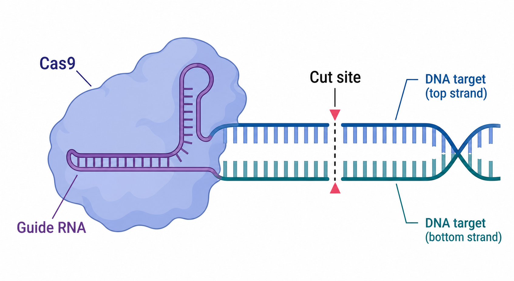{#fig-crispr width=85%}

## 场景 2：模型与环境配置

第一次用 ggai，或切换 backend 时：

```r
# 加载凭据（.env 优先，否则 Sys.getenv）
ggai_load_env()

# 实时探测两个模型 endpoint 是否可达
status <- ggai_capability_status(probe = TRUE)
status$summary
#> - language: openai:gpt-5.5 [configured; reachable (HTTP 200)]
#> - image:    openai:gpt-image-2 [configured; reachable (via responses_api)]

# 切换默认模型
ggai_set_model("language", "claude-sonnet-4-6")
ggai_set_model("image", "openai:gpt-image-2")
```

`ggai_capability_status(probe = TRUE)` 是非常推荐的开机自检——它会真发一个最小请求确认 endpoint 路由可用，避免后续在不可达的代理上反复重试。

## 场景 3：原子图像能力（chroma-key cutout 实战）

最重要的"非自然语言"入口。`gpt-image-2` **静默忽略** `background=transparent` 参数——传 `transparent_background = TRUE` 拿回来的依然是不透明白底。`ggai` 的解法是 **chroma-key workflow**：

```r
# 1. Prompt 包含 chroma-key 背景指令
prompt <- paste(
  "stylized activated T cell, rounded membrane with prominent TCR receptor details,",
  "scientific figure illustration",
  "clean biorender-style biomedical illustration, isolated subject cutout, no labels",
  "perfectly flat solid #00ff00 chroma-key background for background removal",
  "background must be one uniform color with no shadows, gradients, texture, reflections",
  "do not use #00ff00 anywhere in the subject",
  sep = ", "
)

# 2. 生成（按 gpt-image-2 合法尺寸，1024×1024 满足 655,360 px 下限）
out <- ggai_generate_image(
  model = ggai_image_model(),
  prompt = prompt,
  output_dir = tempdir(),
  width = 1024, height = 1024,
  quality = "high"
)

# 3. 本地抠图（移植自官方 Codex imagegen skill 的算法）
cutout <- ggai_remove_background(
  out$images[[1]]$path,
  key_color = "#00ff00"
)
```

`ggai_remove_background()` 算法要点：

- **auto-key border sampling**：取整圈 border 像素的**中位数**作为 key（比 4 角均值鲁棒）
- **smoothstep 软掩膜**：在 `transparent_threshold` 与 `opaque_threshold` 之间做平滑 alpha 过渡（不是 0/255 硬切）
- **dominance penalty**：检测"key 通道远强于非 key 通道"的像素（黄绿色边缘），把它们也变半透明
- **despill**：对部分透明的 key-like 像素，把 key 通道 cap 到非 key anchor，消除绿色边缘溢出

效果对比：

::: {layout-ncol=2}
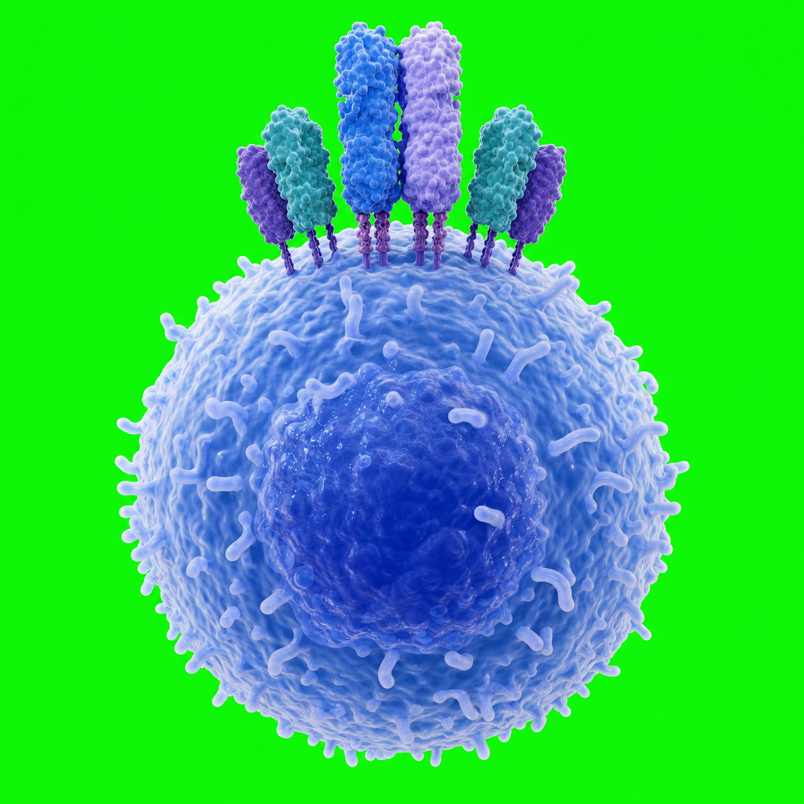{#fig-tcell-raw width=80%}

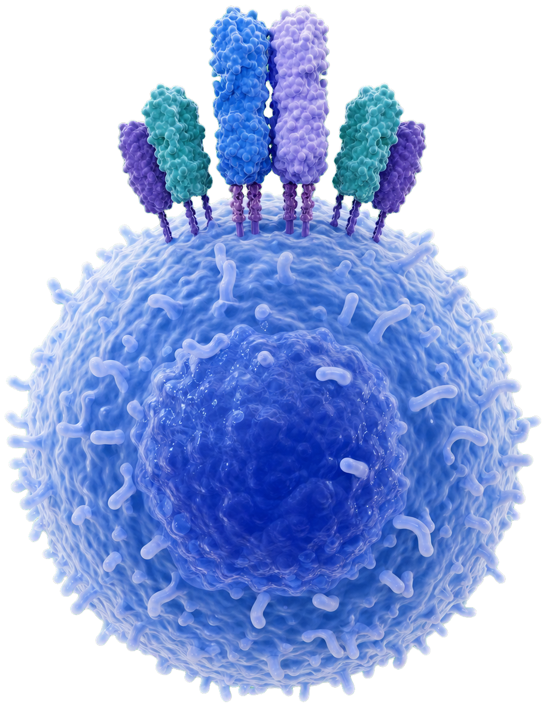{#fig-tcell-cutout width=80%}
:::

注意右图的受体小棒边缘——despill 已经把绿色溢出清理干净，没有典型的"绿色 halo"瑕疵。

## 场景 4：现有 ggplot 精修

让 image-model 把你的 ggplot **重绘**成 publication-ready 版本，同时**保留数据语义**：

```r
library(ggplot2)
p <- ggplot(iris, aes(Sepal.Length, Sepal.Width, color = Species, shape = Species)) +
  geom_point(size = 3, alpha = 0.85) +
  labs(title = "Iris sepal dimensions by species",
       x = "Sepal length (cm)", y = "Sepal width (cm)") +
  theme_minimal(base_size = 13)

result <- polish_figure(
  p,
  instruction = paste(
    "Redraw as a publication-ready scientific scatter plot",
    "with a light pastel palette, larger axis labels,",
    "subtle gridlines, and a clean white background.",
    "Preserve all data positions, axis ranges, point shapes by species, and the title."
  ),
  width = 1536, height = 1024,
  quality = "high"
)

result$best$path   # 路径到最优候选
```

`polish_figure()` 内部做了三件事：

1. **prepare_polish_bundle**：把 base plot 渲为 PNG，外加 geometry overlay（红点标 data position）和 layout overlay（绿框标 axes/legend 位置）作为硬约束 reference
2. **image-model 重绘**：把 instruction + 三张 reference 喂给 `ggai_edit_image()`
3. **multi-candidate scoring**（可选）：生成多张候选，按视觉质量评分挑最优

效果：

::: {layout-ncol=2}
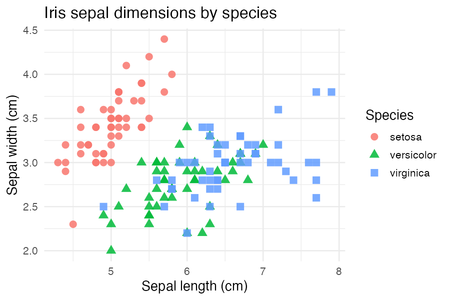{#fig-polish-before width=85%}

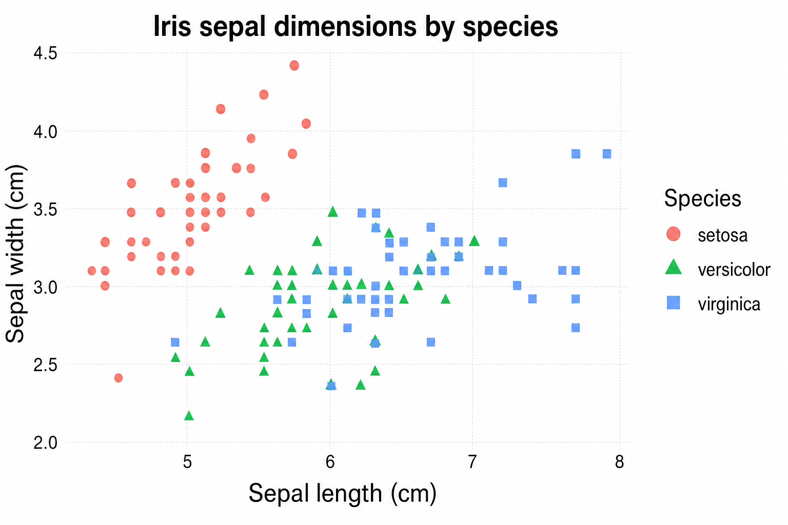{#fig-polish-after width=85%}
:::

`polish_figure()` 不会改变数据点位置和轴范围（这是它的强约束），只在 typography / palette / 视觉风格上重做。

## 场景 5：多 ggplot 组合 / 复合布局

`ggai` **不自己造布局轮子**——多图组合用社区事实标准 [`patchwork`](https://patchwork.data-imaginist.com/) 和 [`ggh4x`](https://teunbrand.github.io/ggh4x/)。Agent 在生成代码时也是直接调它们。

```r
library(ggplot2)
library(patchwork)

p_volcano <- ggplot(diffexp_results, aes(log2FC, -log10(padj))) + geom_point() + ...
p_heatmap <- ggplot(top_genes_long, aes(sample, gene, fill = expression)) + geom_tile() + ...
p_pathway <- ggplot(go_results, aes(NES, reorder(term, NES))) + geom_col() + ...

# 复合布局：左侧火山 + 右上 heatmap + 右下 pathway
fig1 <- (p_volcano | (p_heatmap / p_pathway)) +
  plot_layout(widths = c(2, 1)) +
  plot_annotation(tag_levels = "A")

# 以物理单位固定面板尺寸保存（避免 ggsave 缩放变形）
ggsave("figures/figure1.pdf", fig1, width = 24, height = 16, units = "cm")
# 需要精确锁定 panel 物理尺寸：ggh4x::force_panelsizes(rows = unit(6, "cm"), cols = unit(8, "cm"))
```

ggai 在这一步的作用是 **agent 把自然语言翻译成上面这段 patchwork 代码**，不是再封一层 `compose_plots()`。

## 场景 6：自定义 agent / verb tool 扩展点

如果默认的三把 verb tool 不够，可以自定义：

```r
my_tools <- c(
  ggai_create_verb_tools(),                                   # 三把默认
  list(
    aisdk::tool(name = "fetch_pubmed_abstract",
                description = "Fetch PubMed abstract by PMID",
                input_schema = ..., handler = ...)
  )
)

my_agent <- ggai_create_agent(
  system_prompt = paste(ggai_system_prompt(),
                        "\n\nWhen the user mentions a PMID, fetch the abstract first."),
  tools = my_tools,
  skills = c("ggai-data-plot", "ggai-figure-polish"),         # 限定 skill 集合
  model = ggai_language_model()
)

ggai_run_agent(my_agent, "Plot the gene expression from PMID:12345678")
```

---

# 真实科研案例集 {#sec-cases}

本章把 `ggai` **接到课题组真实的 `clusterProfiler` 文献库**——`final_library/` 中的 41 篇高影响力论文（2024-2025，覆盖 Nature/Nature Communications/Nature Aging/Nature Medicine/Nature Cancer/Nature Protocols/The Innovation 等）。

每个案例都做 **side-by-side 对比**：

> **论文真实发表的图（从 PDF 直接提取）** ←→ **ggai 当天一行调用生成的对应图**

让导师和组里同学一眼看到："如果当年用 ggai，这张图能怎么做？省多少功夫？哪些图是 BioRender 做不出来的、但 ggai 能做的？"

::: {.callout-note}
所有 ggai 产出图为 2026-05-18 真实 `gpt-image-2` 调用（1536×1024，quality=high，平均 ~55 s/张）。论文原图通过 `pdftoppm` + bbox 裁切从 PDF 提取。
:::

## 案例 1：clusterProfiler 元学习——把工具讲给学生 {#sec-case-cp-meta}

### 背景

📄 **#3 · The Innovation 2024**：*Thirteen years of clusterProfiler*（Yu G.）—— 13 年开发回顾。这是 `clusterProfiler` 作者本人的 letter。
📄 **#1 · Nature Protocols 2024**：*Using clusterProfiler to characterize multiomics data*（Xu, Hu, Cai *et al.*）—— 31 页官方 protocol，~109k 字。

两篇文章共同回答两个问题：**(a) clusterProfiler 在生信生态中扮演什么角色？(b) 怎么把它用好？**

### 子案例 1A：clusterProfiler 隐喻图——艺术化抽象

paper #3 的 Figure 1 是一张**敦煌壁画风格的女娲造人图**：多组学数据从四周汇入，经由 clusterProfiler，被组织成“生物学理解”。它不是普通配图，而是把工具定位、项目历史和文化叙事压进一张 commissioned hero illustration；这类图通常需要委托专业插画师，耗时数天到数周。

::: {layout-ncol=2}
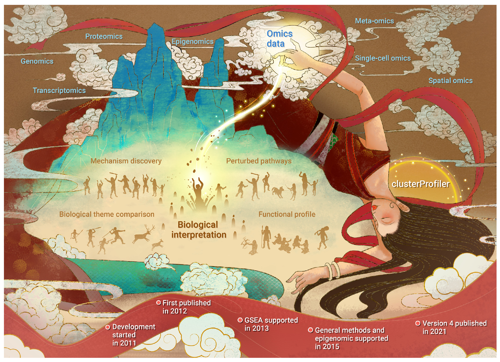{#fig-nuwa-orig width=98%}

{#fig-nuwa-ggai width=98%}
:::

**对比讨论**：

| 维度 | 论文原图（女娲） | ggai 产出（概念首稿） |
|---|---|---|
| 图的职责 | 封面级叙事图：工具定位 + 文化隐喻 + 发展史 | 概念验证图：先把核心隐喻讲清 |
| 创作时间 | 数周（委托插画师 + 多轮审稿） | ~60 s（一次 prompt） |
| 成本 | \$500+（艺术家费用） | ~\$0.10（API token） |
| 艺术与信息密度 | 高，且高度定制 | 明显低一档，但当天可进入讨论 |
| 适合场景 | 旗舰论文 Figure 1、项目代表图 | 选题会、组会、grant 草图、无预算项目 |
| 修改方式 | 找回画师继续协作 | 改 prompt 立刻重出 |

**所以这个 case 不能证明 ggai 已经能替代 commissioned illustration。** 它能证明的是：原本“没有美术预算就很难开始”的隐喻图，现在可以在当天先拿到一个方向正确的首稿，再决定是否值得投入真正的艺术制作。

### 子案例 1B：教 ORA / GSEA——白板手画的替代

新人第一次读 Nature Protocols 总卡在 ORA 与 GSEA 的算法直觉上。传统做法是讲师白板手画，或者去 paper 截图——质量参差。

::: {layout-ncol=2}
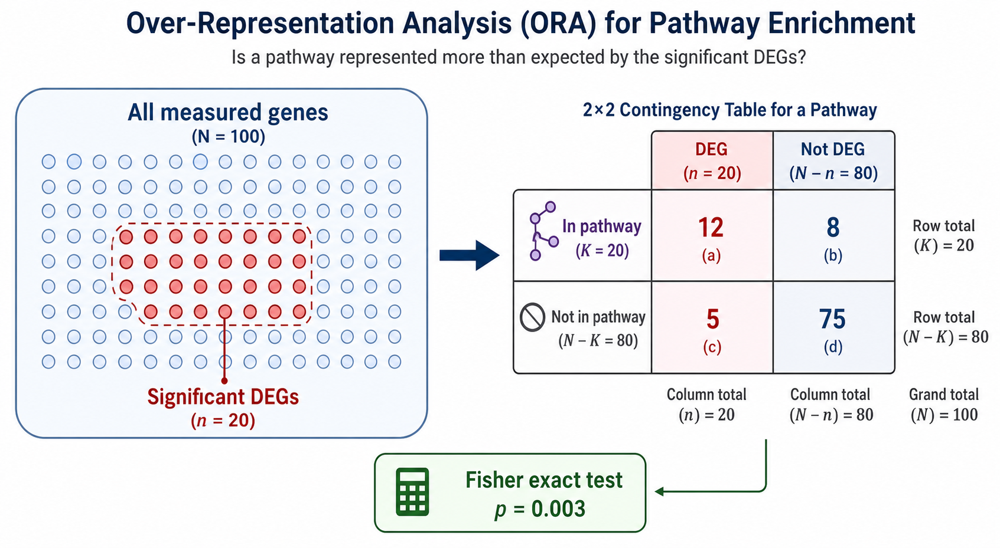{#fig-ora width=95%}

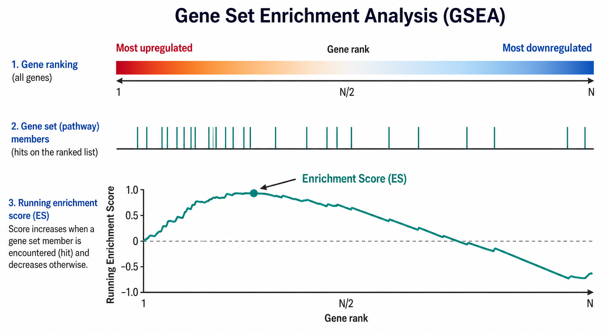{#fig-gsea width=95%}
:::

| 替代品 | 当前做法 | ggai 后 |
|---|---|---|
| 给本科生讲 ORA/GSEA | 白板手画 + 让学生看 paper | 一段话生成、可定制 |
| 新人 onboarding | 师兄发 PPT 截图 | 按自己理解 prompt 重生成 |
| 课题组 Wiki | 缺图、纯文字 | 每个概念配一张原创图 |
| 投课程基金的教学示例 | 找开放素材 | 自产、版权清晰 |

---

## 案例 2：多组学整合 schematic ——Nature Protocols Fig 1 复刻 {#sec-case-multiomics-fig}

### 背景

📄 **#1 · Nature Protocols 2024** 的 Figure 1 是教科书级的多组学 → clusterProfiler → 4 类下游应用 schematic。这是该类工作流图的**事实模板**。

### Side-by-side 对比

::: {layout-ncol=2}
{#fig-prot-orig width=98%}

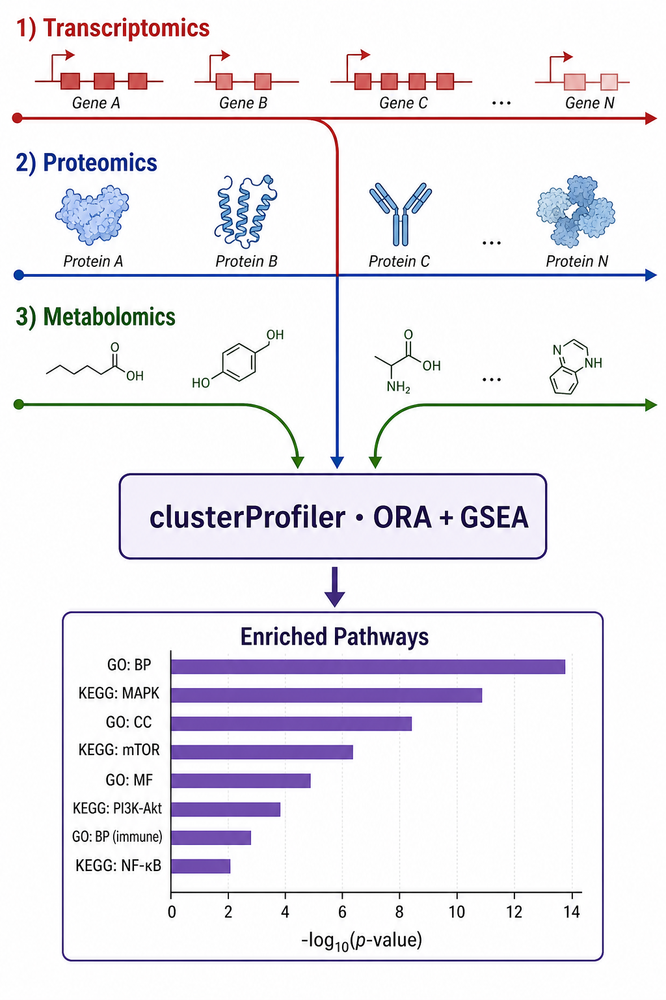{#fig-prot-ggai width=70%}
:::

### 复盘：能不能让 ggai 再贴近论文一点？

可以——ggai 的优势就是 **prompt 可参数化**。当前 ggai 产出与 paper #1 Fig 1 的 gap：

| paper #1 Fig 1 元素 | 当前 ggai 产出 | 拉齐方式 |
|---|---|---|
| 6 个 omics 入口（含 epigenomics/microbiome/spatial）| 只画 3 个 | prompt 加："Six parallel omics tracks: ..." |
| 右侧 4 类下游应用 panel | 输出为单一 bar chart | prompt 加："four application icons branching out" |
| 中央 clusterProfiler R logo | 中央节点是文字标签 | prompt 加："centered R logo style emblem" |

**5 分钟改 prompt 重出**，不需要重新约画师 / 改 Illustrator 文件。

---

## 案例 3：单细胞 + 空间转录组——3 类图同时支持 {#sec-case-scrna}

### 背景

📄 **#6 · Nature Communications 2024**：*Single-cell and spatial transcriptomics analysis of non-small cell lung cancer*（De Zuani, Xue *et al.*）—— ~900,000 细胞 / 25 患者 / 36 张 Visium 切片。
📄 **#23 · J Transl Med 2025**：HCC fibroblast subtypes via scRNA + spatial。
📄 **#22 · Oncogene 2024**：gastric cancer liver metastasis 单细胞免疫景观。

这类研究的 Figure 1 通常是**双 modality 流程示意图**；Figure 3-5 是**真实数据的 UMAP + 通路 + 空间分布**。ggai 同时支持这两类——下面三张图分别对应。

### 三层对比

::: {layout-ncol=2}
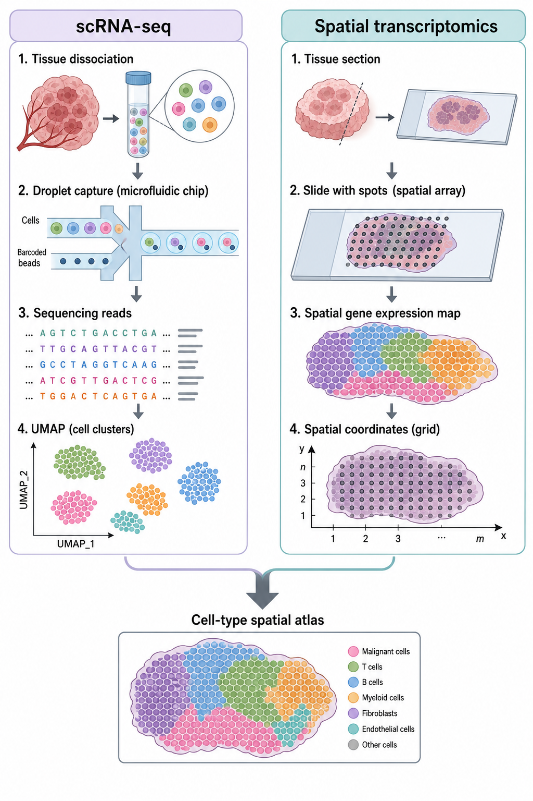{#fig-scrna-flow width=98%}

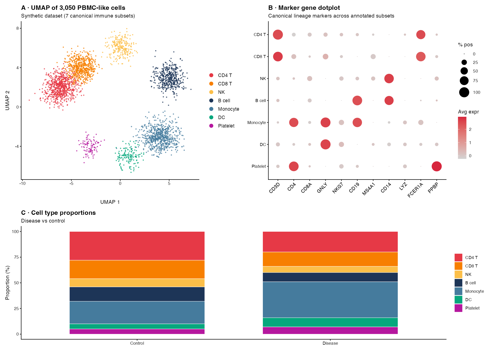{#fig-scrna-real width=98%}
:::

{#fig-scrna-orig width=78%}

### 三张图同源、能力图谱

| 图类型 | 调用路径 | 入口函数 |
|---|---|---|
| 流程 schematic | image-model 直出 | `ggai("画一张单细胞+空间组流程示意")` |
| UMAP + dotplot composite | R 代码路径 | `ggai("用 obj 画 UMAP + marker dotplot + 比例图")` |
| Visium 空间分布 | 真实数据 + ggplot/`Seurat::SpatialFeaturePlot` | `ggai("用 visium_obj 画 5 个 ligand-receptor 对的 spatial co-expression")` |

**关键**：从 Figure 1 到 Figure 5，**单一工具单一 prompt 语言**贯穿，不用切换 BioRender + Seurat + Illustrator 三套工具。

---

## 案例 4：衰老机制 → 实验数据 → 富集分析——完整 paper 闭环 {#sec-case-aging}

### 背景

📄 **#14 · Nature Aging 2024**：*Aging promotes MASLD by inducing ferroptotic stress*（Du, Wang *et al.*）—— 衰老 → 肝细胞 ferroptosis → MASLD 的因果链，配套 Fer1 干预实验。
📄 **#16 · Nature Aging 2025**：sarcopenia 中 BCAA 代谢异常。
📄 **#20 · Nature Aging 2025**：Parkinson 大规模血浆蛋白组。
📄 **#21 · Nature Aging 2024**：血细胞代谢图谱，发现 uridine 恢复衰老 HSC。
📄 **#37 · J Transl Med 2025**：小鼠脑衰老时空转录组。

一篇完整的 Nature Aging paper 通常包含：**机制 cartoon (Fig 1) + 真实实验数据 (Fig 2-6) + 富集分析 (ED Fig 1)**。下面三组对比覆盖这三层。

### 4A · 机制 cartoon：论文 Fig 7 vs ggai schematic

::: {layout-ncol=2}
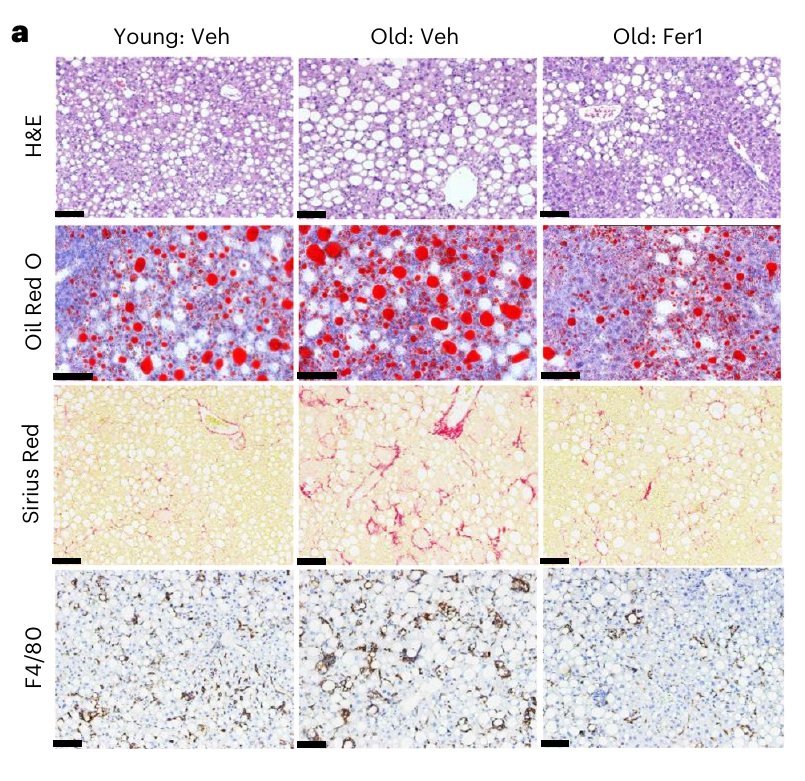{#fig-aging-orig-1 width=85%}

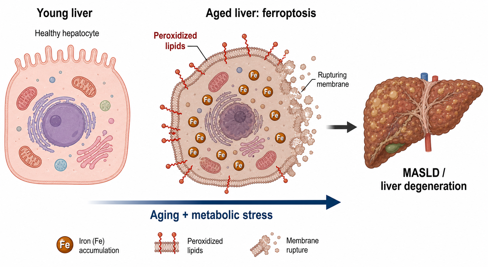{#fig-aging-ggai-1 width=98%}
:::

### 4B · 富集分析：论文 ED Fig 1 vs ggai composite

::: {layout-ncol=2}
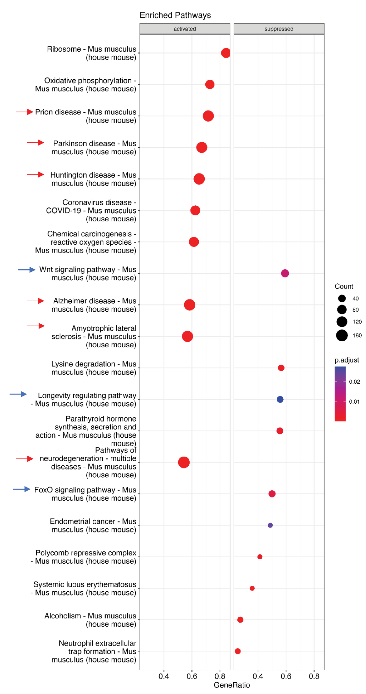{#fig-aging-orig-2 width=58%}

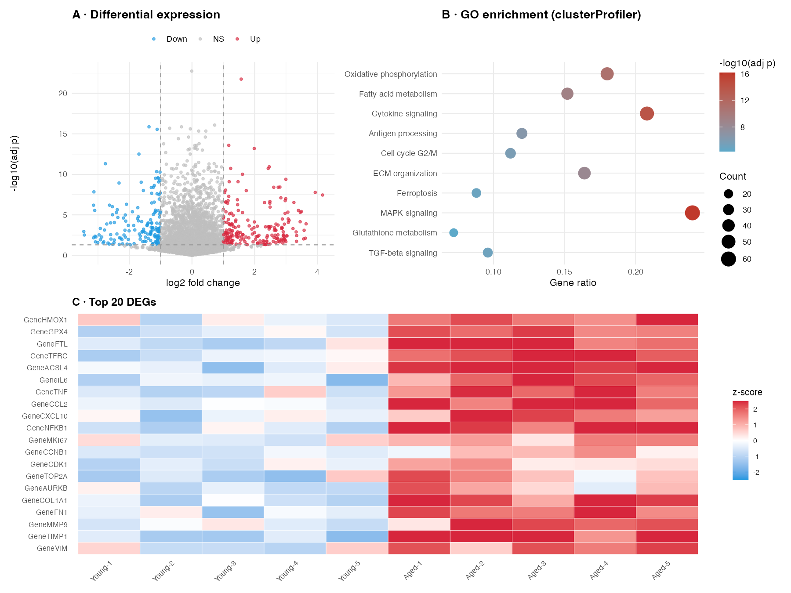{#fig-aging-ggai-2 width=98%}
:::

### 4C · 双场景复用

同一张机制 cartoon，**一次 prompt，多种受众**：

| 场景 | 调用方式 | 受众 |
|---|---|---|
| 论文 Figure 1 cartoon | 上图直接用 | 同行评审 |
| 答辩 PPT 关键 slide | 同一张图 + 加 chapter 标题 | 评委 |
| 公众号科普稿 | 改 prompt："去掉 Fe 化学符号、加中文标签 '铁'" | 一般公众 |
| 课题组 Wiki "我们在做什么" | 改 prompt：加更多解释性箭头 | 新人 / 合作方 |
| 高校招生宣讲 | 加 prompt："增加 '日常生活中可观察到的现象'" | 高考考生 |

**论文 Figure 1 cartoon 通常会被作者画 3 次**（投稿版、答辩版、科普版）——ggai 把这变成 1 次 + 几次微调。

---

## 案例 5：转录因子富集——paper #1 Figure 3 复盘 {#sec-case-tf}

### 背景

📄 **#1 · Nature Protocols 2024** 的 Figure 3 展示 `clusterProfiler` 一个**冷门但威力大的能力**：跨多个时间点、跨多个 TF family 的功能特征比较 dotplot。

### Side-by-side

::: {layout-ncol=2}
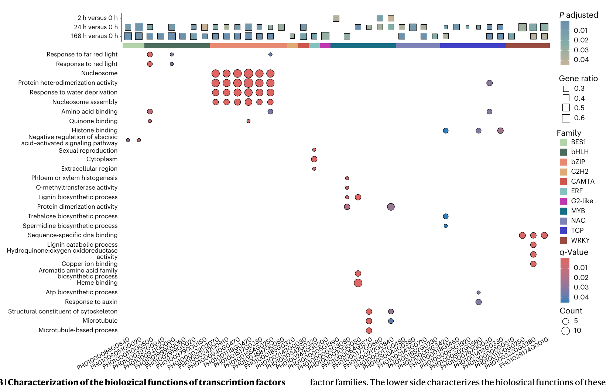{#fig-tf-orig width=95%}

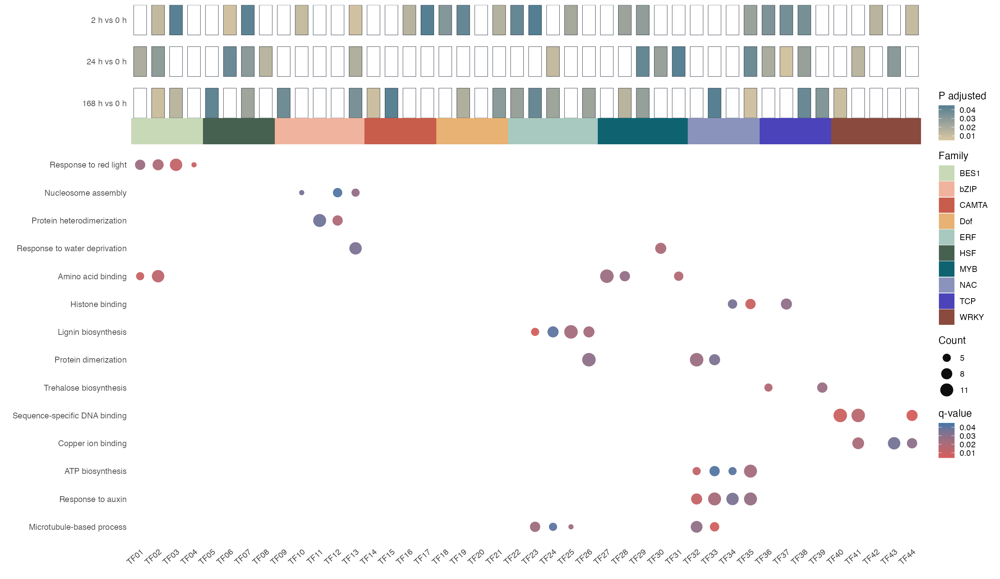{#fig-tf-ggai width=95%}
:::

### 关键观察

这个案例的门槛不在“会不会画一个 dotplot”，而在于能不能把**多层信息压进同一张可读的比较图**：

1. 下半区不是普通富集图，而是共享 x 轴的 `TF gene × GO term` 主矩阵。
2. 上半区还要再挂两层 annotation：时间点命中条、family 色条。
3. 点大小、点颜色、离散 family 颜色三套图例都要同时成立，且不能互相抢读者注意力。

`clusterProfiler` / `enrichplot` 当然能给你基础富集结果，但 Figure 3 这一类图通常已经超出“直接调一个 `dotplot()`”的范围，需要把多个结果表重新组织成 composite。**ggai 的价值**不是把普通 dotplot 包装得更漂亮，而是把这种多层图形意图翻译成一套可复现的 R 组合图方案。

```r
ggai("把 tf_enrich_tbl 画成 Figure 3 风格的比较矩阵：
      主图 x 轴是 TF gene、y 轴是 GO term；
      上方增加 time-point 命中条和 TF family 注释条；
      点大小表示 count，点颜色表示 q-value；
      family 用离散色条，所有 panel 共用 x 轴，白底 minimal 主题。")
```

---

## 案例总结：四种场景，一套工具栈 {#sec-case-summary}

横向对比 5 个案例：

| 案例 | 文献依据 | 论文图来源 | ggai 调用类型 | 主要受众 |
|---|---|---|---|---|
| § 6.1A 隐喻图 | #3 (Innovation) | 委托艺术家 | image-model 直出（艺术风格） | 论文 Figure 1、宣传海报 |
| § 6.1B 算法教育 | #1, #3 | 白板手画 / 截图 | image-model 直出（BioRender 风格） | 本科生 / 新人 |
| § 6.2 多组学 schematic | #1 (Nat Protocols) | 论文 Fig 1 | image-model 直出 | 投稿 / 综述 |
| § 6.3 scRNA + spatial | #6 (Nat Comm), #22, #23 | 论文 Fig 1, Fig 3 | image-model + R 代码混合 | 同行评审 / 组会 |
| § 6.4 衰老机制 + 数据 | #14 (Nat Aging), #16, #20, #21, #37 | 论文 Fig 1, Fig 7, ED Fig 1 | image-model + R 代码混合 | 论文 + 公众科普 |
| § 6.5 TF 富集 dotplot | #1 (Nat Protocols Fig 3) | clusterProfiler::dotplot() | R 代码（ggplot 调参） | 投稿 |

### 共性观察

1. **同一份工具栈，两条路径**——image-model 路径管 schematic / cartoon / 艺术化；R 代码路径管真实数据图。**Agent 自动选**。
2. **论文图的"再做一遍"成本被压平**——投稿 reviewer 要求改 Figure 1 配色？5 分钟 + 几美分。BioRender 重新拖一遍？1-2 小时。
3. **跨论文沉淀知识**——课题组从过往论文（41 篇）里看哪些 prompt 套路有效，把它们写进 `inst/skills/*.SKILL.md`，下一届新人直接复用。
4. **科研 ↔ 教育的双向流动**——为论文做的机制图能再生成一个简化版做课堂讲义，反过来也成立。

### 一句话

> **`ggai` 把"做图"这件事，从 BioRender + Illustrator + Seurat + ComplexHeatmap + PowerPoint 的拼缝 workflow，压缩成一条可参数化、可复现、可教学的 R 流水线——而且全部用中文自然语言驱动。**

---

# 工程实践 {#sec-engineering}

## 测试与持续验证

- **430 个测试 / 0 失败 / 0 警告**（[`tests/testthat/`](../tests/testthat/)）
- 覆盖：artifact 引擎、所有 verb tool、skill 加载、image 后处理算法、capability probe、agent factory
- Mock 策略：image API 调用全部 mock 化（`local_mocked_bindings(ggai_generate_image = ...)`），CI 不烧 API token

## 文档与 NAMESPACE 自动化

- `roxygen2` 注释 → `devtools::document()` 自动生成 `man/*.Rd`
- NAMESPACE **手工管理**（避免 roxygen 在 export 上的精确度问题）
- AGENTS.md 强制每个新 PR 同步更新 doc + NAMESPACE + test

## Skill-driven 开发

加新能力的**首选路径**：

1. 写 `inst/skills/ggai-<topic>/SKILL.md`
2. 跑 `devtools::load_all()`，自动注册
3. `ggai_skill_prompt_section(query = "...")` 验证选中
4. 不需要改任何 R 函数、不需要发版

只有当 skill 需要的能力**当前不存在**时（需要新的 verb tool / 新的引擎适配器 / 新的图像后处理算法），才回到 R 层添代码。

---

# 与同类工具的关系 {#sec-positioning}

```{mermaid}
%%| label: fig-positioning
%%| fig-cap: "ggai 定位：数据保真度 × 视觉精度的二维空间"
quadrantChart
    title 数据保真度 vs 视觉精度
    x-axis "纯视觉表达" --> "强数据语义"
    y-axis "代码低门槛" --> "出图高质量"
    quadrant-1 "publication 级数据图"
    quadrant-2 "publication 级概念图"
    quadrant-3 "草图工具"
    quadrant-4 "ggplot 默认"
    "ggplot2 + theme_minimal": [0.78, 0.42]
    "BioRender": [0.20, 0.80]
    "Illustrator 手绘": [0.15, 0.95]
    "PowerPoint": [0.10, 0.35]
    "直接调 OpenAI Image API": [0.30, 0.55]
    "ggai": [0.75, 0.85]
    "Claude Code / Codex 通用": [0.50, 0.70]
```

### 与典型替代品的差异

| 维度 | BioRender | 纯 ggplot | 直接调 OpenAI | Claude Code | **ggai** |
|---|---|---|---|---|---|
| 概念图 | ✓ 但限于预制 asset | ✗ | ✓ 但要自己写 prompt | ✓ 通用 | ✓ 领域 prompt 模板 |
| 数据图 | ✗ | ✓ | ✗ | ✓ 通用 | ✓ 引擎感知 |
| 自动 chroma-key 抠图 | – | – | ✗ | ✗ | ✓ |
| 跨引擎重渲染 | – | ✗ | – | ✗ | ✓ |
| 领域知识沉淀 | 平台预制 | 个人代码片段 | 无 | 无 | SKILL.md 可贡献 |
| 复用机制 | 只能复制 BioRender 文件 | 复用 R 函数 | 复用 prompt 模板 | 复用 prompt | 复用 skill + artifact |
| 在 R 流水线里 | ✗ | ✓ | 手动来回 | ✓ 通用 | ✓ 原生 |

### 与 aisdk 的关系

`ggai` **不拥有 agent runtime**。所有 agent loop / tool calling / prompt 管理都委托给 [`aisdk`](https://github.com/YuLab-SMU/aisdk)。`ggai` 在 aisdk 之上贡献的是：

- **领域 verb tools**（execute/render/inspect 是科研做图领域的最小工具集）
- **领域 skills**（13 个 markdown 知识包）
- **引擎适配层**（让 LLM 不用关心 ggplot vs ComplexHeatmap）

这种分工让 `ggai` 可以专注于"科学绘图"这个垂直问题，不用维护通用 agent 基础设施。

---

# Roadmap {#sec-roadmap}

## 已就绪能力（截至 2026-05）

- ✅ 7 个绘图引擎适配（ggplot/grid/patchwork/ComplexHeatmap/circlize/htmlwidget/image-model）
- ✅ 13 个领域 skill
- ✅ chroma-key 抠图工作流（移植自 Codex 官方 imagegen 算法）
- ✅ Reference-based polish（geometry + layout overlay 作为硬约束）
- ✅ Live capability probe
- ✅ aisdk 集成（Responses API fallback、prompt cache）

## 近期 (Q2 2026)

- [ ] 新 skill：剪接图（spliceR / ggtranscript）
- [ ] 新 skill：网络可视化（igraph / ggraph）
- [ ] Skill 互相调用（orchestration 真正生效）
- [ ] artifact 跨会话持久化 + 增量复用

## 远期

- 视频/动画支持（短 gif 渲染流水线）
- 成本控制（按 token 预算选模型）
- 端到端可复现性证书（artifact + 输入数据 hash → 一键复跑）

---

\appendix

# 附录 A：入口函数 cheatsheet {#sec-cheatsheet}

按场景排，一页带走：

| 我要... | 函数 |
|---|---|
| **画一个图** | `ggai("...")` |
| 配模型/API | `ggai_load_env()` · `ggai_set_model()` · `ggai_capability_status(probe=TRUE)` |
| 原子图像生成 | `ggai_generate_image()` · `ggai_edit_image()` · `ggai_remove_background()` |
| 评分候选图 | `evaluate_figure_candidate()` |
| ggplot 精修 | `polish_figure()` · `prepare_polish_bundle()` |
| 多图组合 | 直接用社区工具 `patchwork::wrap_plots()` / `+` 操作符 + `ggplot2::ggsave()` / `ggh4x::force_panelsizes()`（ggai 不再造轮子）|
| ggplot 散点用 AI icon | `geom_point_ai()` |
| 自定义 agent | `ggai_create_agent()` · `ggai_run_agent()` · `ggai_create_verb_tools()` · `ggai_system_prompt()` |
| Artifact 手工流 | `ggai_execute_and_capture()` · `ggai_inspect_artifact()` · `ggai_validate_artifact()` · `ggai_render_artifact()` · `ggai_save_artifact()` |
| 读包/帮助/源码 | `ggai_check_package()` · `ggai_inspect_help()` · `ggai_vignette_index()` · `ggai_inspect_github_url()` · `ggai_list_local_files()` · `ggai_read_local_file()` · `ggai_summarize_sources()` |
| 统计辅助 | `ggai_stat_profile()` · `ggai_select_stat_method()` |
| Skill 知识注入 | `ggai_skill_prompt_section(query = "...")` |
| 契约 schema | `new_ggai_task()` · `new_visual_brief()` · `new_analysis_brief()` · `new_ggai_agent_trace()` (+ `validate_*` / `serialize_*`) |
| aisdk 结构化输出 schema | `z_ggai_figure_prompt_spec()` · `z_ggai_glyph_spec()` · `z_ggai_diagram_spec()` |

---

# 附录 B：一个真实任务的 walkthrough {#sec-walkthrough}

假设组里给的任务是：**"用我的 bulk RNA-seq 差异表达结果，做一张 figure 1：包含火山图、top genes heatmap、和一张机制示意图"**。

## Step 1：自动化部分

```r
library(ggai)
ggai_load_env()

# 一行启动 agent
result <- ggai(paste(
  "Make a 3-panel figure 1 from `deg_results` (data frame with columns",
  "gene, log2FC, padj) and `expr_mat` (matrix, rows=genes, cols=samples).",
  "Panel A: volcano plot.",
  "Panel B: heatmap of top 30 DEGs.",
  "Panel C: schematic of how the up-regulated genes converge on TGF-beta signaling.",
  "Layout: A on the left taking half the width, B and C stacked on the right."
))
```

Agent 内部会：

1. 识别 `deg_results` 是 data.frame → 加载 `ggai-data-plot` skill
2. 识别"heatmap of top 30" → 加载 `ggai-complex-heatmap` skill
3. 识别"schematic" → 加载 `ggai-direct-figure` skill
4. 识别 3 panel + 嵌套布局 → 加载 `ggai-patchwork-layout` skill
5. 分别生成：
   - Panel A 的 ggplot 代码 → execute → inspect → render
   - Panel B 的 ComplexHeatmap 代码 → execute → render（注意 ComplexHeatmap 没有 grob，重渲染走 device 重 draw）
   - Panel C 的 image-model 调用（TGF-β 通路示意）→ 走 chroma-key 还是 opaque 由 skill 决定
6. 用 `patchwork::wrap_plots(..., design = ...)` 拼成最终布局
7. 用 `ggplot2::ggsave()`（或 `ggh4x::force_panelsizes()` 锁定 panel 物理尺寸）落盘

## Step 2：人工微调

如果某个 panel 不满意，单独重做：

```r
# 只重做 Panel B 的 heatmap，加上行注释
result$panels$heatmap <- ggai("Redo the heatmap with row annotation showing pathway membership")

# 重新组合（直接 patchwork）
library(patchwork)
final <- wrap_plots(result$panels, design = result$design) +
  plot_annotation(tag_levels = "A")
ggsave("figure1_v2.pdf", final, width = 24, height = 16, units = "cm")
```

## Step 3：精修 / 投稿前 polish

```r
polished <- polish_figure(
  final,
  instruction = "Nature-style typography, light pastel palette, no shadows, white background",
  quality = "high"
)
```

整个过程，用户写了**3 段自然语言 + 0 行 ggplot/ComplexHeatmap 代码**。所有 R 代码由 agent 生成、执行、验证；所有引擎差异由 ggai 适配层吸收。

---

# 附录 C：贡献一个新 skill {#sec-contributing}

加一个"画通路转导级联"的 skill：

```bash
mkdir -p inst/skills/ggai-signaling-cascade
```

`inst/skills/ggai-signaling-cascade/SKILL.md`：

```markdown
---
name: ggai-signaling-cascade
description: |
  Generate a multi-step signaling cascade diagram with sequential
  arrows between proteins/molecules. Use when the user wants to
  show "X activates Y activates Z ...".
aliases:
  - "signaling cascade"
  - "signal transduction"
  - "phosphorylation cascade"
when_to_use: Use when the user describes a sequential signaling pathway with named molecules and directional activations.
user-invocable: false
---

# Signaling Cascade Diagram

Your job: lay out N named molecules left-to-right (or top-to-bottom for tall canvases), connected by arrows labeled with action verbs (phosphorylates / inhibits / binds).

## Prompt schema

(... 略 ...)

## Key constraints

- Use `ggai_generate_image()` for naturalistic versions,
  or write grid/ggplot code for fully editable diagrams.
- For >5 nodes, prefer code (image models start to drop nodes).
```

跑：

```r
devtools::load_all()
ggai_skill_prompt_section(query = "show me the MAPK cascade")
# 应该返回 ggai-signaling-cascade 的内容
```

不用改 R 代码、不用加测试、不用发版。下次别人调 `ggai("画一个 MAPK 信号通路级联")` 时，这份知识就会被 agent 看到。

---

::: {.callout-note}
## 复现说明

本报告中所有图像由 `ggai` 调用 `openai:gpt-image-2` 在 2026-05-18 真实生成。源 `.qmd` 文件位于 `dev_docs/ggai-introduction-report.qmd`，所有 demo 图保存在 `dev_docs/figures/`。
:::
